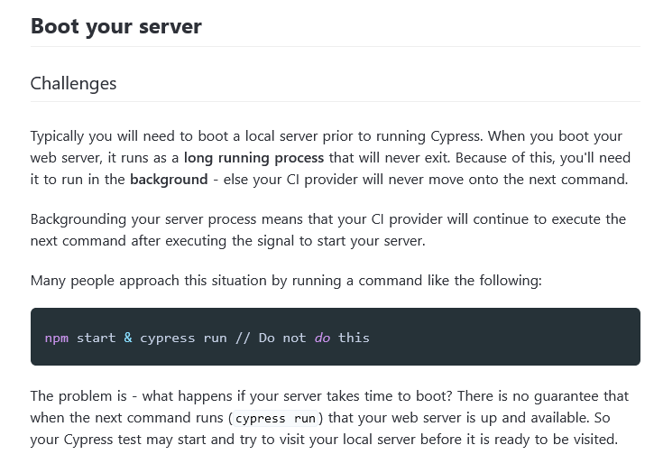

## 

Michael Lynch ([@deliberatecoder](https://twitter.com/deliberatecoder))

https://decks.mtlynch.io/cypress-vs-playwright/

---

### Experience

* Intermediate Cypress user (four years experience)
* Beginner Playwright user (four months experience)
* Never written custom plugins for either
  * I've used some third-party Cypress plugins

---

### Experience

* [PicoShare](https://github.com/mtlynch/picoshare): (open-source) Minimalist web app for sharing files
* Ported 10 nontrivial E2E tests from Cypress to Playwright

---

### Playwright is significantly faster than Cypress

| Task                               | Cypress | Playwright | Difference                      |
| ---------------------------------- | ------- | ---------- | ------------------------------- |
| Run tests on CircleCI              | 127s    | 84s        | <font color="green">-34%</font> |
| Run tests from development machine | 40s     | 7s         | <font color="green">-83%</font> |

---

#### Cypress has redundant assertions

* Cypress bundles [nine different third-party libraries](https://docs.cypress.io/guides/references/bundled-libraries)
* Cypress uses `should`, `expect`, and `assert` depending on context

---

#### Cypress has redundant assertions

These two snippets are functionally equivalent

```javascript
cy.get("#error-message").should("be.visible");
```

```javascript
cy.get("#error-message").should(($el) => expect($el).to.be.visible);
```

---

#### Playwright has a single right way


```javascript
expect(page.locator("#error-message")).toBeVisible();
```

---

### Cypress assumes a desktop GUI


---

### Playwright works headless

<video controls="" width="600">
  <source src="playwright-web-ui.mp4" type="video/mp4">
  Your browser does not support the video tag.
</video>

---

#### Cypress uses non-standard JavaScript

```javascript
// Save the route to the guest link URL so that we can return to it later.
cy.get('.table td[test-data-id="guest-link-label"] a')
  .invoke("attr", "href")
  .then(($href) => {
    // Log out.
    cy.get("#navbar-log-out").click();
    cy.location("pathname").should("eq", "/");

    // Make sure we can still access the guest link after logging out.
    cy.visit($href);

    // Continue with the test
  });
```

---

#### Cypress uses non-standard JavaScript

* Cypress' `then()` doesn't return a real `Promise` object
* Cypress ticket [requesting `then()` support `await`](https://github.com/cypress-io/cypress/issues/1417)
  * No progress in four years
  * Dev team recently announced they [have no plans to implement it](https://github.com/cypress-io/cypress/issues/1417#issuecomment-1133112085)

---

### Playwright uses real `Promise`s

```javascript
// Save the route to the guest link URL so that we can return to it later.
const guestLinkRouteValue = await page
  .locator('.table td[test-data-id="guest-link-label"] a')
  .getAttribute("href");
expect(guestLinkRouteValue).not.toBeNull();
const guestLinkRoute = String(guestLinkRouteValue);

// Log out.
await page.locator("#navbar-log-out").click();
await expect(page).toHaveURL("/");

// Make sure we can still access the guest link after logging out.
await page.goto(guestLinkRoute);

// Continue with the test.
```

---

#### Cypress makes text comparisons hard

```html
<p data-test-id="github-instructions">
  Visit our
  <a href="https://github.com/mtlynch/picoshare">Github repo</a> to create your
  own PicoShare server.
</p>
```

Naive test:

```javascript
cy.get("[data-test-id='github-instructions']").should(
  "have.text",
  "Visit our Github repo to create your own PicoShare server."
);
```

```text
Timed out retrying after 10000ms
+ expected - actual

-'\n      Visit our\n      Github repo to create\n      your own PicoShare server.\n    '
+'Visit our Github repo to create your own PicoShare server.'
```

---

#### Cypress makes text comparisons hard

```html
<p data-test-id="github-instructions">
  Visit our
  <a href="https://github.com/mtlynch/picoshare">Github repo</a> to create your
  own PicoShare server.
</p>
```

Correct test:

```javascript
cy.get("[data-test-id='github-instructions']").should(($el) => {
  expect($el.get(0).innerText).to.eq(
    "Visit our Github repo to create your own PicoShare server."
  );
});
```

---

#### Unsurprising text comparisons in Playwright

```html
<p data-test-id="github-instructions">
  Visit our
  <a href="https://github.com/mtlynch/picoshare">Github repo</a> to create your
  own PicoShare server.
</p>
```

```javascript
await expect(page.locator("data-test-id=github-instructions")).toHaveText(
  "Visit our Github repo to create your own PicoShare server."
);
```

---

#### Cypress: "You figure out app/test orchestration"



---

#### Playwright launches your app for you

```javascript
webServer: {
  command: "PS_SHARED_SECRET=dummypass PORT=6001 ./bin/picoshare",
  port: 6001,
},
```

---

### Cypress can't log to stdout

```javascript
console.log("hello from Cypress"); // this does nothing
```

```javascript
cy.log("hello from Cypress"); // this prints nothing to the terminal
```

---

### `console.log` in Playwright just works

```javascript
console.log("hello from Playwright");
```

```text
[chromium] › auth.spec.ts:3:1 › logs in and logs out
hello from Playwright
```

---

### Playwright team feels more responsive

* I've had Cypress PRs sit ignored for months
* Playwright triaged and responded to my bug in one business day
* Open bug counts
  * Cypress: 2,782
  * Playwright: 603

---

##### Playwright integrates well with VS Code

* Auto-complete helpful for finding right API


---

#### Playwright makes parallel tests easier

* Parallel tests are one of the killer features of Cypress' paid service
  * Can run parallel tests for free, not as convenient
* Parallel tests are first-class citizens in Playwright
  * Testing in parallel against the same server is still a challenge even if Playwright makes it easier

---

#### Cypress' syntax is more consistently fluent

```javascript
cy.get(".navbar-item [data-test-id='log-in']").should("be.visible");
```

---

#### Playwright's syntax feels less natural to me

How Playwright works:

```javascript
await expect(
  page.locator(".navbar-item [data-test-id='log-in']")
).toBeVisible();
```

What I want:

```javascript
// INVALID - not how Playwright actually behaves
await page
  .locator(".navbar-item [data-test-id='log-in']")
  .expect()
  .toBeVisible();
```
---

### Summary

1. Playwright is significantly faster than Cypress
1. Cypress has redundant assertions
1. Playwright works headless
1. Playwright uses real `Promise`s
1. Cypress makes text comparisons hard
1. Playwright launches your app for you
1. Cypress can't log to stdout
1. Playwright team feels more responsive
1. Playwright integrates well with VS Code
1. Playwright makes parallel tests easier
1. Cypress' syntax is more consistently fluent
