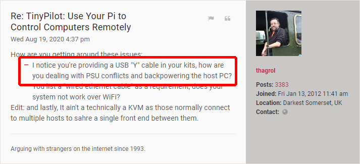

+++
title = "Manufacturing an Electronic Component"
subtitle = "From Start to Finish"
date = 2020-10-13
conference = "Indie Hackers - October"
outputs = ["Reveal"]
+++

## 

### 

 13, 2020

Michael Lynch ([@deliberatecoder](https://twitter.com/deliberatecoder))

https://decks.mtlynch.io/indie-hackers-2020-10/

---

### Background

* Raspberry Pi's annoying power design.

* The Pi accepts power on the USB-C port
  * This is the device's only USB-OTG port.

---

### Background

* TinyPilot needs the USB OTG port to connect to a computer's USB port.
  * Computer USB ports output too little power for the Pi.

---

### Background: Y-cables?

* A Y-cable seemed like the answer!

---

### Background: Y not?

---

### Goal

* Split access to the Raspberry Pi's USB-C port
  * Should accept 3 Amps of power.
  * Should also function as a USB port.
  * Prevent incorrect flows of power.
* Need it fast.

---

### Day 1

The engineering firm begins work on the circuit board for the power connector.

It's a simple enough board that they're able to design it and order 100 printed circuit boards from China the same day.

---

### Day 2

* I ask 3D printing lab to design a case for the power board.
* Within hours, they send me a work-in-progress image of the case design.

---

### Day 5

The 3D printing lab completes their design and gets ready to begin printing a few prototype cases.

 

---

### Day 8

The engineering firm receives the bare PCBs from their overseas manufacturer.

* Still need to solder on the components.
* 3D printing lab produces first two case prototypes.
  * I ship them to the electrical engineers.

---

### Day 9

* Cases fit the boards

 

 

* Large gaps around the port because 3D printing lab erred on the side of caution.

---

### Day 10

* I receive the first two board prototypes.
  * They're soldered by hand as the engineers build automation
* They work!

---

### Day 13

* 3D printing shop prints their first batch of 30 cases.
* Still a small gap around the microUSB ports, but not a showstopper.

---

### Day 19

I receive the first completed panel of 24 PCBs from the engineering firm.

* Manufacturing process was automation + manual fixes.

---

### Day 20

* The 3D printer finishes the remaining 70 cases.
* They include 10 experimental cases.

I like this new design so much that I switch all future production to black cases.

---

### Day 21

I begin sending out the first completed power connectors as replacements to legacy customers.

---

### Day 26

* I receive the remaining 74 completed boards
* With 100 cases and boards ready, the first run of production is complete.

---

### Costs

* Boards: $2,897.70
  * Design: $241.72
  * Materials: $422.16
  * Assembly, testing, packaging: $2,579.04
  * Postage: $76.95
* Cases: $500.00
* **Total**: **$3,297.64**

Per-unit cost: $32.97

Case costs are after 75% subsidy from [MA Innovation Voucher](https://www.uml.edu/research/crf/state-voucher-program.aspx).

---

### What went well

* Luck
  * Almost everything worked well.
* Limited the number of vendors involved
  * Prevented miscommunications, friction.
* Added padding to the time estimates I received

---

### What went well

* Communicated to everyone that I was optimizing for turnaround time
  * I estimated that I lost $50-100 for each day of delay, so I was willing to pay ~$50/day for options to expedite.
* Working in parallel with the 3D printer and electrical engineers

---

### What could have been improved

* Underestimated total number needed
  * After sending out free replacements to ~60 legacy customers, I had only 40 left to sell to new customers.
* PCB assembly time
  * Biggest bottleneck, most costly part.
  * Possible resolution: after prototyping, outsource the assembly and manufacture to two independent PCB manufacturing firms.

---

### What could have been improved

* Functional testing
  * Some units were defective when they arrived to customers.
* Deadline slippage
  * Three week delays happen one day at a time.

---

# Questions?

---

### Bonus: How'd I find vendors?

* Luck
  * For both vendors, I was already in contact with them to discuss other physical improvements to TinyPilot.
* Electrical engineering firm
  * Asked PCB manufacturers for recommendations.
  * [FORGE Mass](https://forgemass.org/): Nonprfit that connects MA startups to manufacturers.
  * **Asked friends for recommendations.**
* 3D Printer
  * Recommendation from a friend.