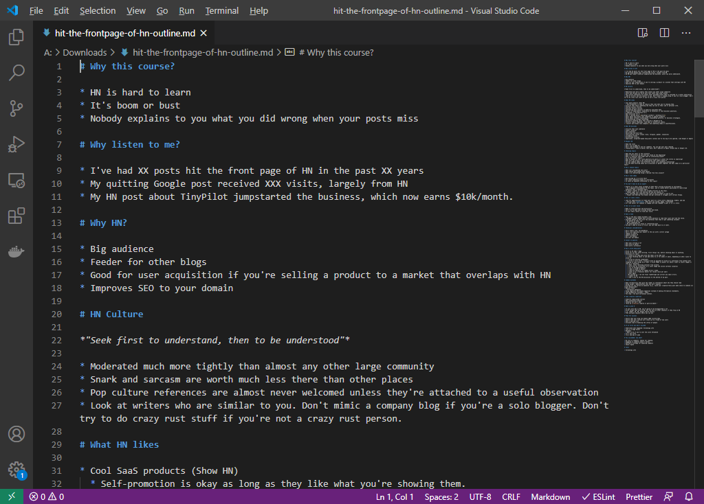
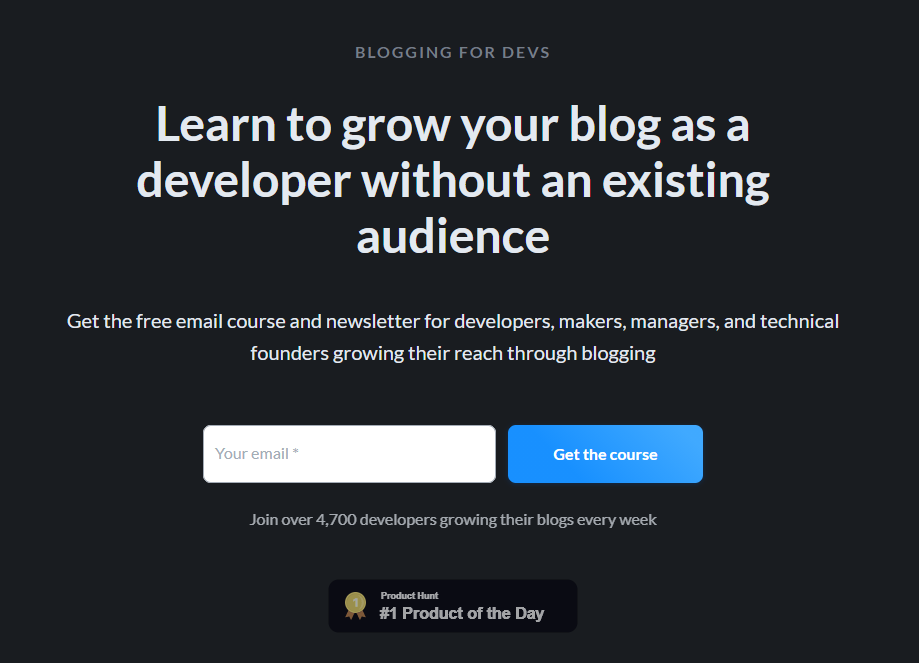
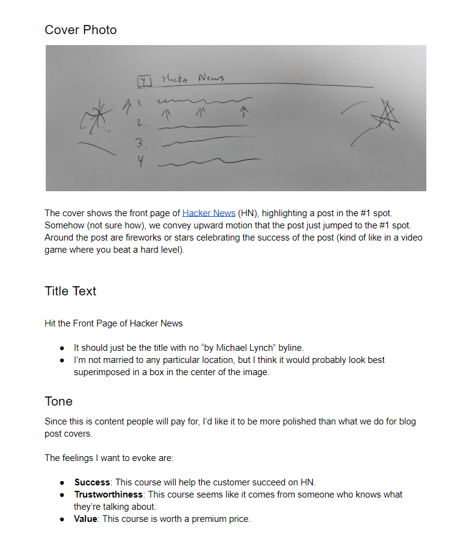
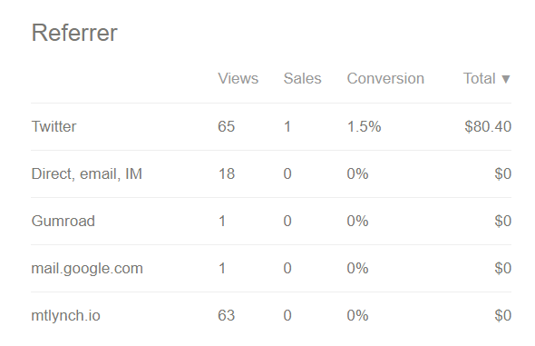
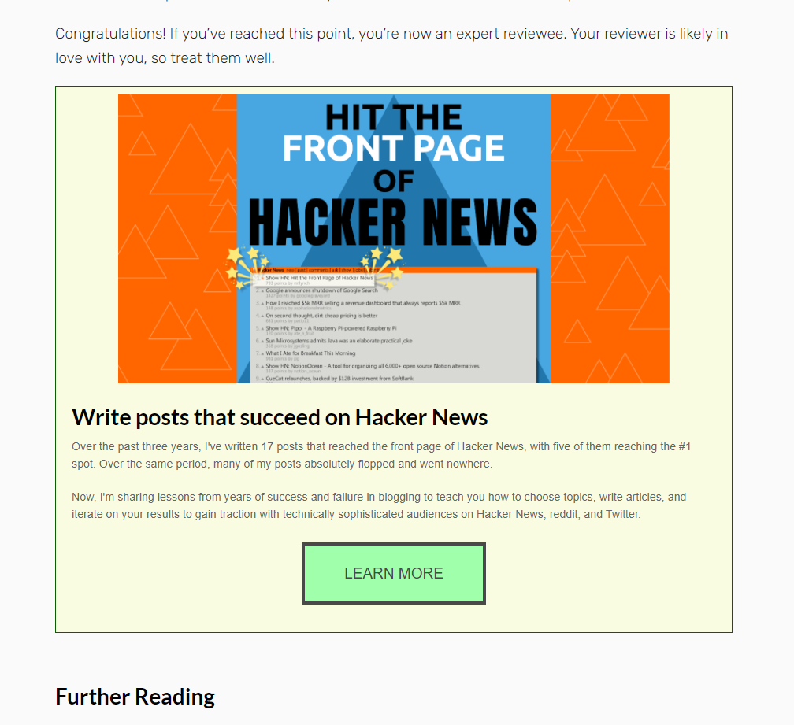
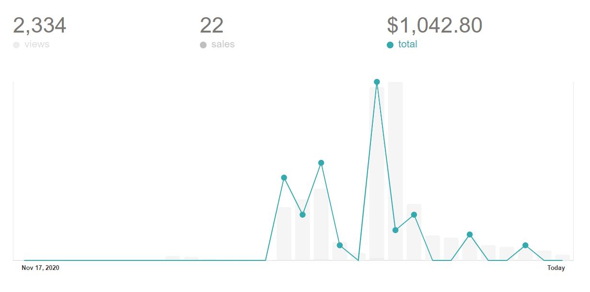
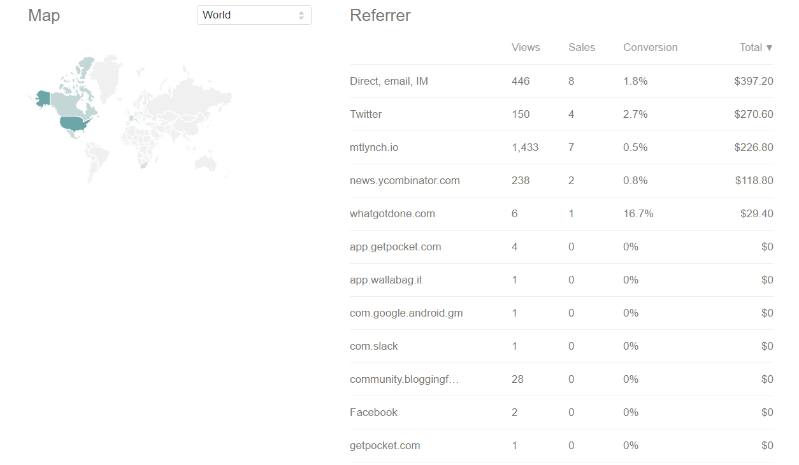
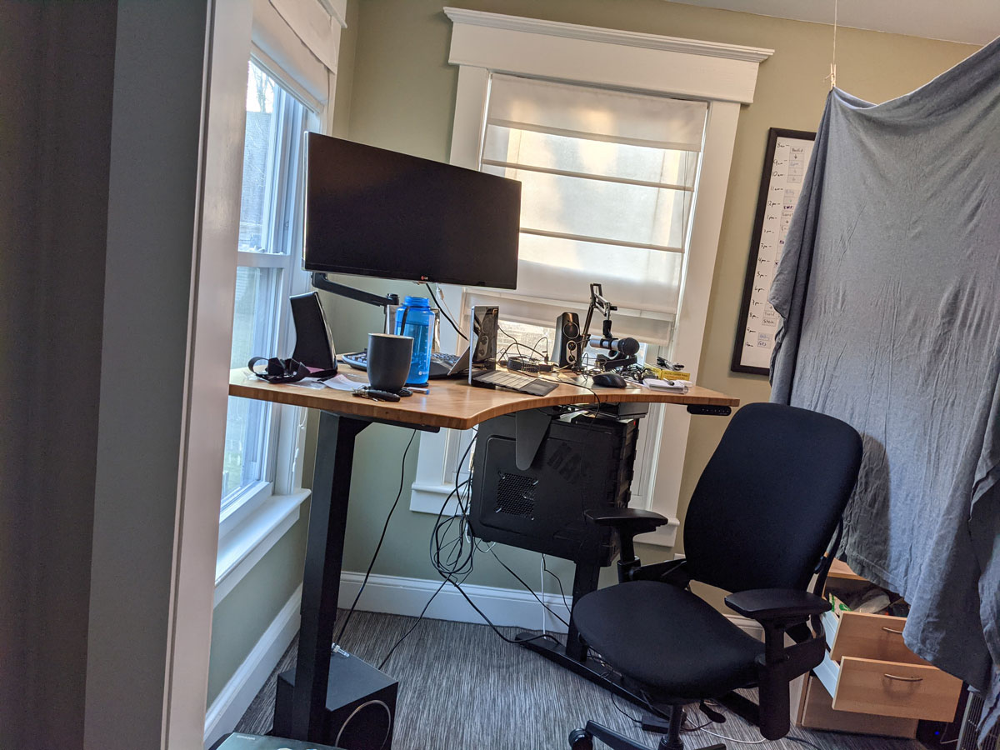

+++
title = "How My First Info Product is Going"
date = 2020-10-13
conference = "Indie Hackers - December"
outputs = ["Reveal"]
+++

## 

 16, 2020

Michael Lynch ([@deliberatecoder](https://twitter.com/deliberatecoder))

https://decks.mtlynch.io/indie-hackers-2020-12/

---

### Why an info product?

* Want a way to earn money from my blog
* Book? Live course? Video course?

---

## Video courses sound easy!

* Daniel Vassallo made his course [in 16 hours](https://t.co/3evuHgEzIk?amp=1)
  * Earned $150k in under a year

---

### Video courses are hard

* I fuss a lot over slides and recording
* I've spent 50-60 hours so far and will likely spend at least 40 hours more

---

### Create an outline

---

### Join a tech blogging community

---

### Commission a cover

---

## The cover

---

### First day of sales

---

### Lower prices

* Changed top tier from $85 to $60
* Changed lowest tier from $50 to $30

---

### Amazing stroke of HN luck

* Three of my articles reached the front page of HN in one week
  * [How I Hired a Freelance Editor for My Blog](https://news.ycombinator.com/item?id=25262272) (published in 2017)
  * [How I Collected a Debt from an Unscrupulous Merchant](https://news.ycombinator.com/item?id=25320941) (published August 2020)
  * [How to Make Your Code Reviewer Fall in Love with You](https://news.ycombinator.com/item?id=25330182)

---

### Self-ads on my blog

---

## Current stats

---

## Sources of sales

---

### Unexpected Challenges

1. Recording software (a lot of it sucks, even paid tools)
1. Writing sales copy
1. Opportunities to record
1. Recording a mostly good 20+ minute speech
1. No native way to do early access on Gumroad

---

### My recording studio

---

### Useful resources

* [Daniel Vassallo's IH interview](https://www.indiehackers.com/podcast/177-daniel-vassallo)
* [*Write Useful Books* by Rob Fitzpatrick](https://writeusefulbooks.com/)
* ["Nail Your First Launch" by Adam Wathan](https://www.youtube.com/watch?v=ajrDxZRpP9M)
  * [Text summary](https://microconf.gen.co/adam-wathan/)

---

# Questions?
