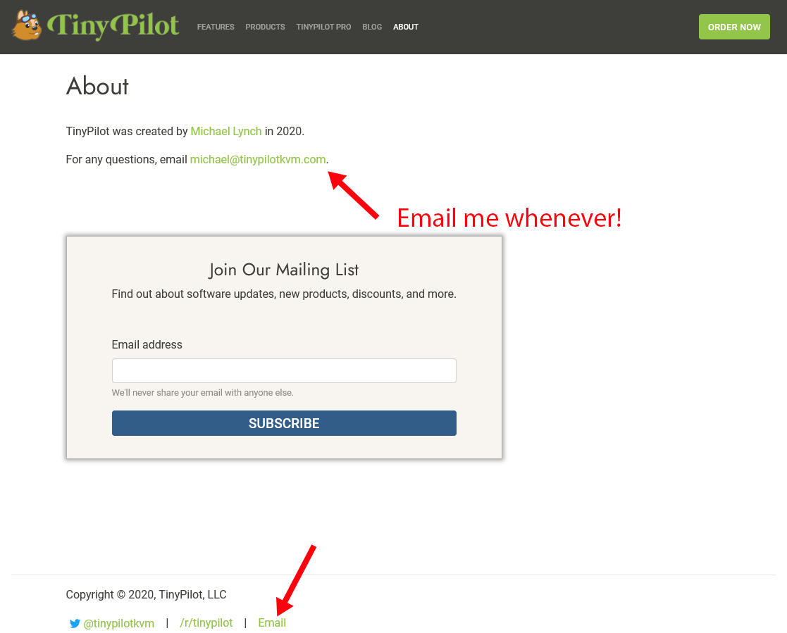
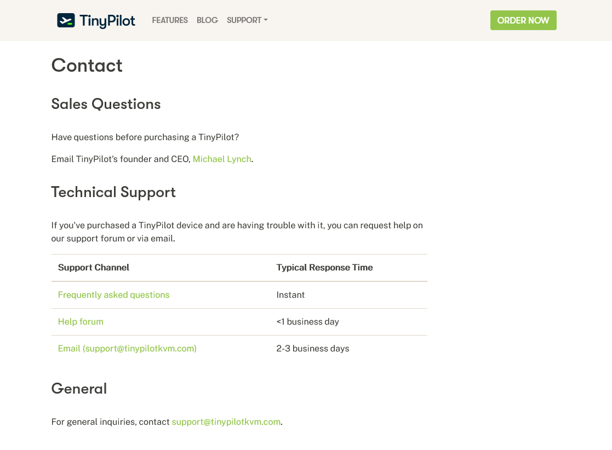
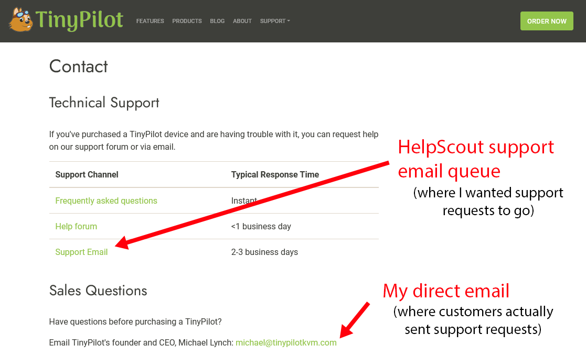
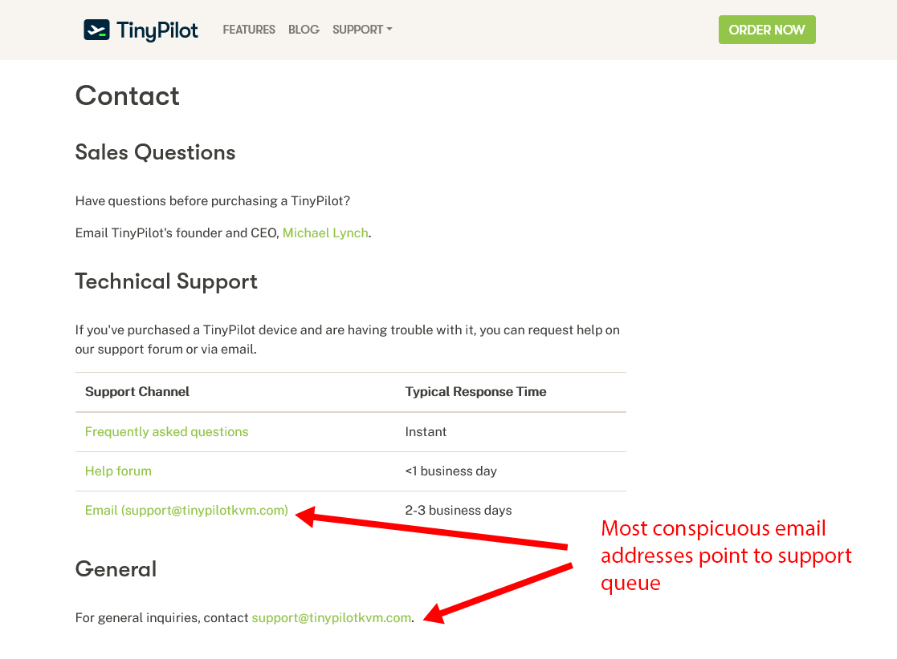
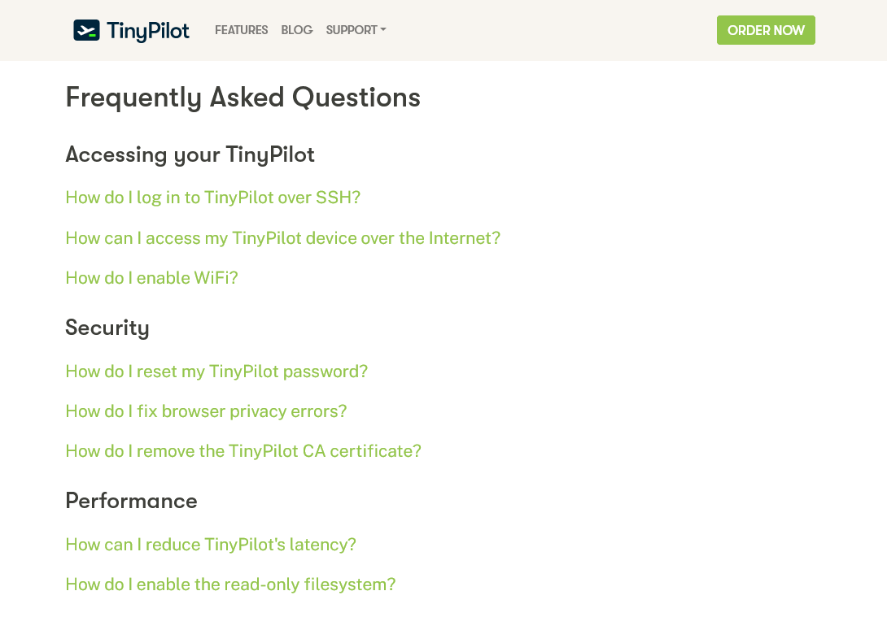
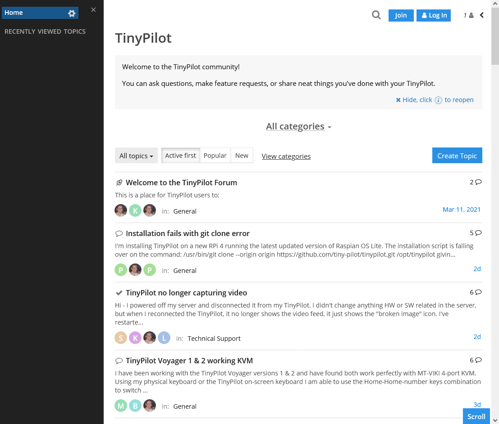
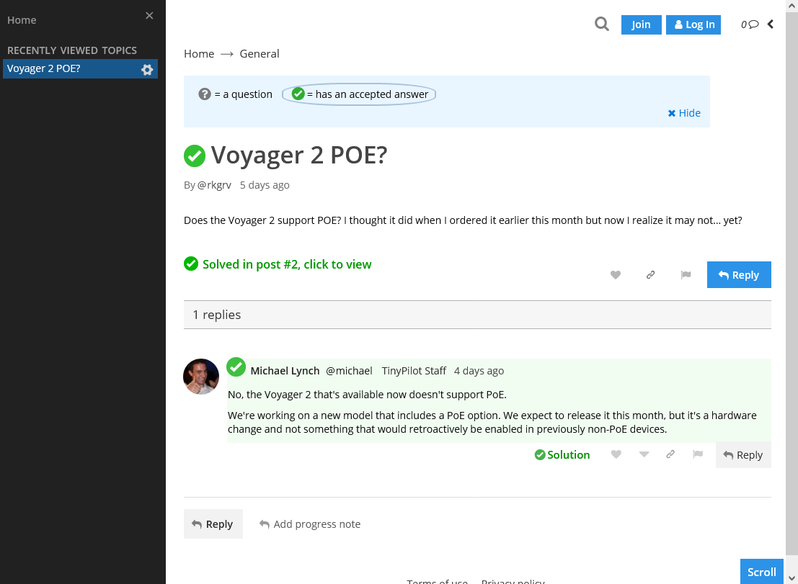
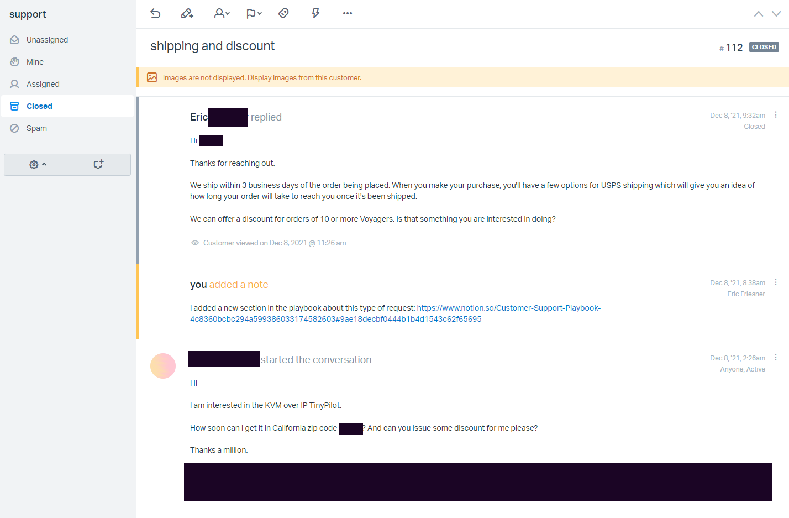
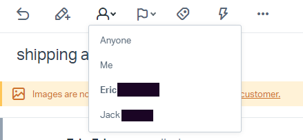

## 

 28, 2022

Michael Lynch ([@deliberatecoder](https://twitter.com/deliberatecoder))

https://decks.mtlynch.io/indie-hackers-2022-01/

---

### In the beginning

I'm super available!

---

### Soon after

* I'm spending 4-5 hours per day responding to customer support emails
* Many of the questions repeat
* Answers aren't reusable

---

### Founder's ideal

* Minimize time on technical support
* Customers submit clear steps to reproduce the issue
* Customers read all of your available documentation
* Customers assign fair, accurate priority levels to all requests

---

### Customer's ideal

* Solve their problem ASAP
* Minimize time explaining the problem
* Avoid:
  * Signing up for a new account
  * Learning a support ticket system
  * Digging through documentation

---

### Support channels

| Support channel  | For customer | For founder  |
|------------------|--------------|--------------|
| Live chat        | Great        | Terrible     |
| Support email    | Good         | Bad          |
| Ticketing system | Bad          | Good         |
| Help forum       | Okay         | Good         |
| Documentation    | Okay         | Great        |

---

##### Incentivize customers to use better support channels

---

### Customers will use the most obvious email

---

### Restructure to present the better email

---

### Build a FAQ

---

### Create a help forum

* I like [TalkYard](https://talkyard.io)
  * Open-source
  * Indie developer
  * Managed hosting starts at $2/month

---

### TinyPilot's help forum

---

### TinyPilot's help forum

---

### Create a help forum

* Builds a public corpus of technical help
* Useful way to search past error message
* Users help each other

---

### Shared inbox \>\>\> private inbox

* Even if you're the only person answering
  * Builds an archive of answers
  * Easy to scale up when you hire
* Offers more support-friendly tools than regular email

---

### HelpScout

---

### HelpScout: Assigning threads

---

## Surprises about customer support

---

## Surprise 1

#### Customers can answer a maximum of two questions per email

---

### Maximum of two questions

>Sorry to hear you're unable to see the remote screen on your TinyPilot!
>
>* Can you go to System > Logs > Get Shareable URL and share the URL with me?
>* Can you go hit the F12 key in Chrome and then click the "Console" tab? Does that show any errors?
>* Have you tried rebooting the device?

---

### Maximum of two questions

>I just tried rebooting the device. It didn't work.

---

## Surprise 2

### Quick responses are bad

---

### Quick responses are bad

* Expectation: "Customers will **love** my lightning-fast replies!"
* Reality: Customers stop being thoughtful when replies are fast

---

### Why do fast responses make customers worse?

* Low latency in replies
* No incentive to capture all relevant information
  * Customer: "If I leave something out, the founder will just ask me for more details in a few minutes."

---

##### Solution: Avoid responding in under 2 hours

* Set expectations on support pages
* Exceptions for legitimately urgent issues (e.g., incorrect shipping address)

---

### Useful resources

* [Lunch Money's Customer Support Optimizations](https://lunchbag.ca/company-of-one/#optimizing-customer-support)

---

# Questions?
