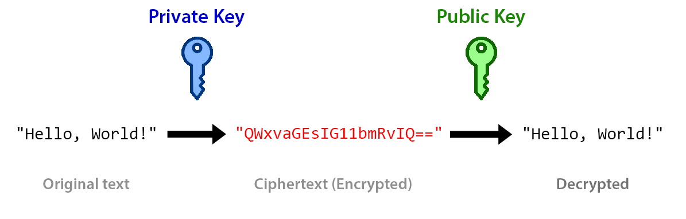
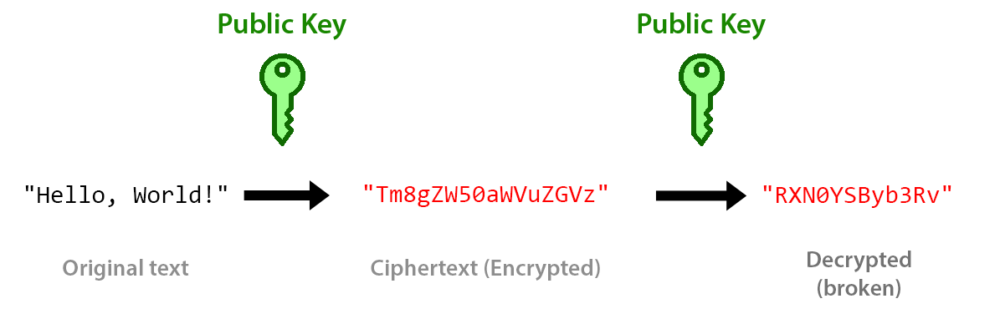
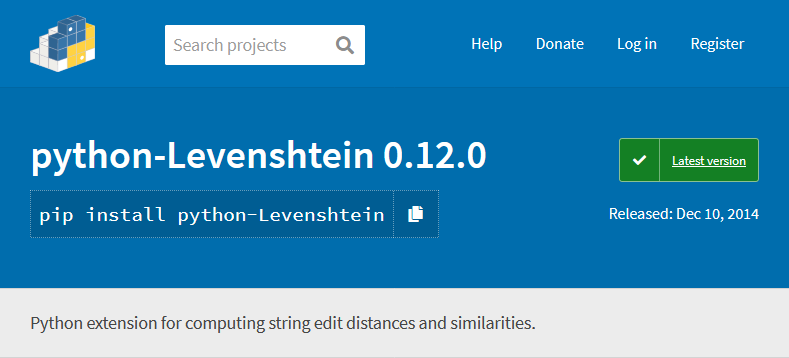
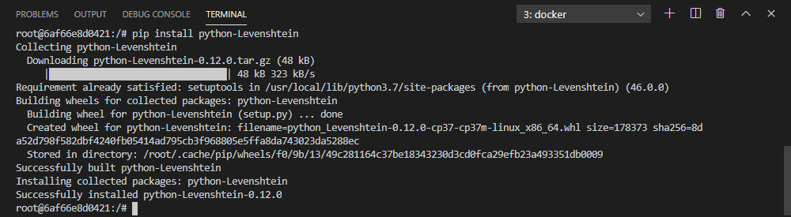
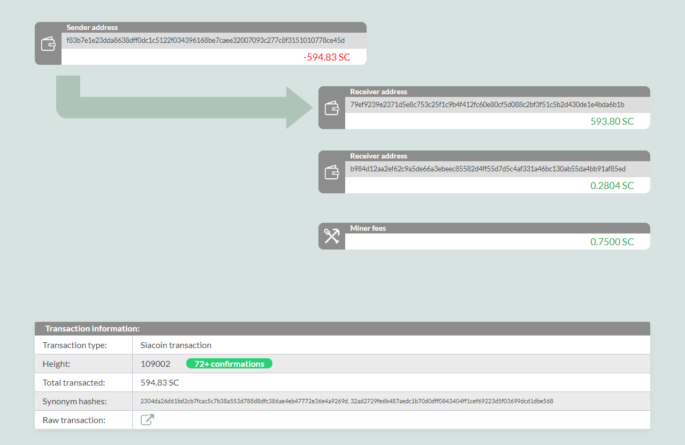
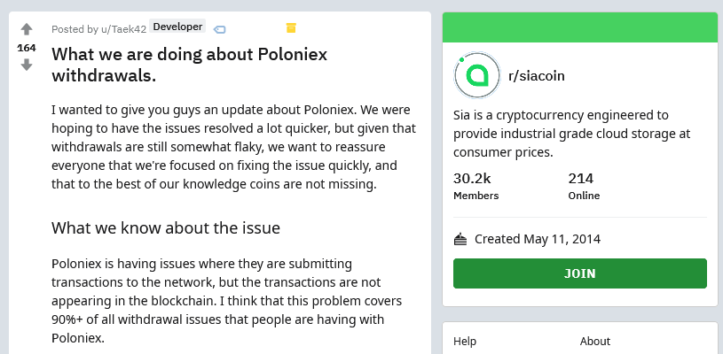
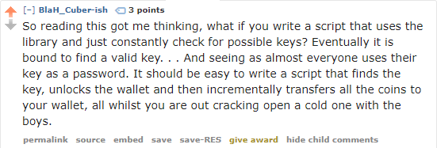
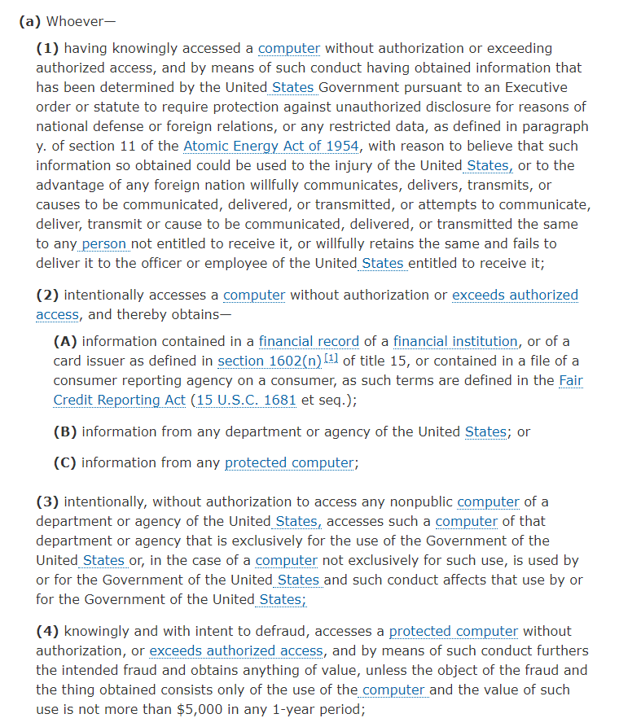
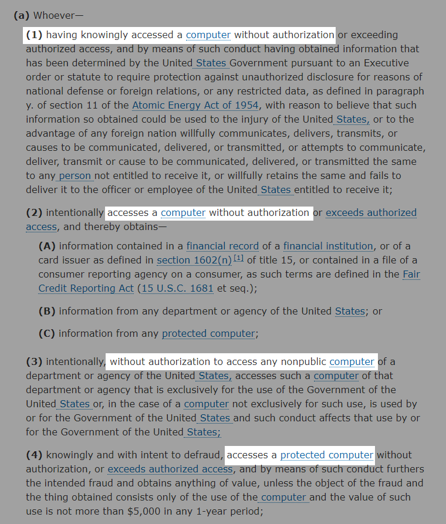

+++
title = "How I Used Python to Steal Money"
date = 2020-03-20
conference = "NERD Summit"
outputs = ["Reveal"]
+++

# How I Used Python to Steal Money

 - March 20, 2020

Michael Lynch ([@deliberatecoder](https://twitter.com/deliberatecoder))

https://decks.mtlynch.io/nerds-2020/

---

### You're all sworn to secrecy

<ul>
{}<li>This is a true story<sup>*</sup></li>{}
{}<li>I really did steal money</li>{}
{}<li>But it was the right thing to do</li>{}
</ul>

{}<p><sup>*</sup>Variable names have been changed to protect the innocent.</p>{}

---

## A brief crash course in cryptocurrency

* For people who don't care about cryptocurrency

---

# What do banks do?


<ol>
{}<li>Confirm your identity</li>{}
{}<li>Manage transfers to/from your account</li>{}
</ol>

---

# Brute forcing bank logins

* Brute force can crack most bank passwords.
  * Banks are responsible for stopping this.


---

### How do you manage financial accounts without a bank?

* Traditional payment processors rely on banks to verify your identity.

---

# Public/private keys

### The heart of cryptocurrency

* Private key
  * Only you know it.
  * Proves that you're you.
* Public key
  * The world knows it.
  * Confirms that messages using your private key are correct.

---

### Encryption/decryption with a public/private keypair



---

### Public/private key encryption is one way



---

### Transfering cryptocurrency with public/private keys

{}
```python
> encrypt("I hereby give $5 to Rick Hood", private_key)
WW8gZG95ICQ1IGEgS2VsbHkgQWxicmVjaHQ=
```
{}

{}
```python
> decrypt("WW8gZG95ICQ1IGEgS2VsbHkgQWxicmVjaHQ=", public_key)
I hereby give $5 to Rick Hood
```
{}

{}
* In short: private keys are like passwords that the world can verify.
{}

---

### Preventing brute force for cryptocurrency

* Banks rate limit attempts to guess every password
  * You can't prevent people from guessing every private key.
  * Private keys must be strong

---

# Private key strength

* 256-bit random value (almost every cryptocurrency)
  * 2<sup>256</sup> possible keys
  * 10<sup>77</sup> possible keys
* Atoms on Earth: 10<sup>50</sup>
* Atoms in the universe: 10<sup>82</sup>

---

# Sia

### A marketplace for disk storage

* Like Airbnb, but for disk space
* Participants pay one another in Siacoin


---

# Private keys on Sia


---

# A seedy reddit post


---

## I spent €2,000 on this Sia thing...


---

## Literally 500 tries


---

### Would publishing my password help?


---

# A seedy reddit post


---

# I'm *pretty sure* I didn't make a mistake


---

# The race is on!

<div style="display: flex; flex-direction: row;">

<div style="display: flex; flex-direction: column; justify-content: center">

* People steal from exposed wallets in minutes
* Sia's price had increased, attracted popular attention

</div>


</div>

---

# Finding the mistake

* Transposed letters?
  * `meat` -> `meta`

---

# Finding the mistake

* Added or subtracted letters?
  * `heart` -> `heat`

---

# Finding the mistake

* Incorrect letter?
  * `tagged` -> `tugged`

---

# Where did those words come from

* How did Sia generate the passphrase?

---

# To the dictionary!

* Sia uses a library called [entropy-mnemonics](https://github.com/NebulousLabs/entropy-mnemonics)
* Its dictionary contains 1,626 words

```golang
  englishDictionary = Dictionary{
    "abbey",
    "abducts",
    "ability",
    "ablaze",
    "abnormal",
    "abort",
    "abrasive",
    "absorb",
    "abyss",
    "academy",
    "aces",
    "aching",
    "acidic",
    "acoustic",
    "acquire",
    "across",
    "actress",
    ...
```
---

# Ctrl+F my way to riches

* Which word is not in the dictionary?


---

# No dice

* Every word is in dictionary

---

# Finding similar words

* How do we find words that are one copying error away from one another?

---

# Levenshtein distance

* Measures "edit distance" between two words

| Word A  | Word B  | Distance  |
|---------|---------|-----------|
| ca**t** | ca**r** | 1         |
| ca**t** | **s**ca**r** | 2    |
| ba**k**er   | b**re**a**d** | 4 |

---

# Framing the problem

```text
eluded logic wise ascend tagged acoustic situated stylishly younger aptitude inroads
avidly hefty also godfather unrest avatar push because brunt viking gone august public
tonic vulture shrugged otter adapt
```

---

# Finding alternate candidates

Checking the word `wise`

| Dictionary word | Levenshtein distance |
|-----------------|----------------------|
| `abbey`         | 4                    |
| `abducts`       | 7                    |
| `ability`       | 6                    |
| ...             | ...                  |
| <span style="background: hotpink">`wife`</span>          | <span style="background: hotpink">1</span>                    |
| `wildly`        | 4                    |

---

# Finding alternate candidates

| Position | Word     | Alternate Candidates |
|----------|----------|----------------------|
| 1        | `eluded` |                      |
| 2        | `logic`  |                      |
| 3        | `wise`   | `wife`               |
| 4        | `ascend` |                      |
| 5        | `tagged` | `jagged`, `nagged`   |
| ...      | ...      | ...                  |

---

### Finding a Levenshtein implementation



---

### Installying python-Levenshtein



---

# Using Levenshtein library

```python
>>> import Levenshtein
>>> Levenshtein.distance('cat', 'scar')
2
```

---

# A quick 'n dirty Levenshtein search

```python
import Levenshtein

seed = raw_input('enter your wallet seed: ')

for seed_word in seed.split():
  for dict_word in open('dictionary.txt'):
    dict_word = dict_word.strip()
    distance = Levenshtein.distance(seed_word, dict_word)
    if distance != 1:
      continue
    print '"%s" -> "%s"\n%s\n' % (seed_word, dict_word,
                                  seed.replace(seed_word, dict_word))
```

---

# Running the search

```text
$ python recover.py
enter your wallet seed: eluded logic wise ascend tagged acoustic situated stylishly younger aptitude inroads avidly hefty also godfather unrest avatar push because brunt viking gone august public tonic vulture shrugged otter adapt

"wise" -> "wife"
eluded logic wife ascend tagged acoustic situated stylishly younger aptitude inroads avidly hefty also godfather unrest avatar push because brunt viking gone august public tonic vulture shrugged otter adapt

"tagged" -> "jagged"
eluded logic wise ascend jagged acoustic situated stylishly younger aptitude inroads avidly hefty also godfather unrest avatar push because brunt viking gone august public tonic vulture shrugged otter adapt

"tagged" -> "nagged"
eluded logic wise ascend nagged acoustic situated stylishly younger aptitude inroads avidly hefty also godfather unrest avatar push because brunt viking gone august public tonic vulture shrugged otter adapt

"aptitude" -> "altitude"
eluded logic wise ascend tagged acoustic situated stylishly younger altitude inroads avidly hefty also godfather unrest avatar push because brunt viking gone august public tonic vulture shrugged otter adapt

"push" -> "lush"
eluded logic wise ascend tagged acoustic situated stylishly younger aptitude inroads avidly hefty also godfather unrest avatar lush because brunt viking gone august public tonic vulture shrugged otter adapt

"brunt" -> "grunt"
eluded logic wise ascend tagged acoustic situated stylishly younger aptitude inroads avidly hefty also godfather unrest avatar push because grunt viking gone august public tonic vulture shrugged otter adapt

"tonic" -> "ionic"
eluded logic wise ascend tagged acoustic situated stylishly younger aptitude inroads avidly hefty also godfather unrest avatar push because brunt viking gone august public ionic vulture shrugged otter adapt

"tonic" -> "sonic"
eluded logic wise ascend tagged acoustic situated stylishly younger aptitude inroads avidly hefty also godfather unrest avatar push because brunt viking gone august public sonic vulture shrugged otter adapt

"tonic" -> "topic"
eluded logic wise ascend tagged acoustic situated stylishly younger aptitude inroads avidly hefty also godfather unrest avatar push because brunt viking gone august public topic vulture shrugged otter adapt

"tonic" -> "toxic"
eluded logic wise ascend tagged acoustic situated stylishly younger aptitude inroads avidly hefty also godfather unrest avatar push because brunt viking gone august public toxic vulture shrugged otter adapt

"adapt" -> "adept"
eluded logic wise ascend tagged acoustic situated stylishly younger aptitude inroads avidly hefty also godfather unrest avatar push because brunt viking gone august public tonic vulture shrugged otter adept

"adapt" -> "adopt"
eluded logic wise ascend tagged acoustic situated stylishly younger aptitude inroads avidly hefty also godfather unrest avatar push because brunt viking gone august public tonic vulture shrugged otter adopt
```

---

# Checking seed candidates

"wise" -> "wife"

```text
$ siac wallet init-seed
Seed: eluded logic wife ascend tagged acoustic situated stylishly younger aptitude inroads avidly hefty also godfather unrest avatar push because brunt viking gone august public tonic vulture shrugged otter adapt

Could not initialize wallet from seed: error when calling /wallet/init/seed: seed failed
checksum verification
```

---

# Checking seed candidates

"tonic" -> "ionic"

```text
$ siac wallet init-seed
Seed: eluded logic wise ascend tagged acoustic situated stylishly younger aptitude inroads avidly hefty also godfather unrest avatar push because brunt viking gone august public ionic vulture shrugged otter adapt

Wallet initialized and encrypted with seed.
```

---

# Checking the loot

```text
$ siac wallet
Wallet status:
Encrypted, Unlocked
Confirmed Balance:   594.8 SC
```

---

# I thought you said €2,000...

* 594.8 SC ~= €10
* Where'd the rest of the money go?

---

# Yoinks



---

# About that €2,000...

```bash
$ siac wallet transactions
[height]          [transaction id]    [net siacoins]   [net siafunds]
  108589   427b72c98e8ea64fba2...         594.83 SC             0 SF
  109002   2304da26d61bd2cb7fc...        -594.55 SC             0 SF
```

---

# Transactions stuck in limbo

* Cryptocurrencies can process a limited number of transactions
  * Usually a few hundred per minute.
* When the network is overloaded, transactions get stuck in limbo.
  * Sender has sent the money, but the recipient hasn't received it.

---

# Poloniex stuck in limbo



---

# How do you steal money when it's not there yet?

* Naive approach: Infinitely set the transfer
  * But what if I incorrectly guess the amount?
* I'm playing *The Price is Right*.

---

# Draining little by little

```
for /l %%x in (1, 0, 100) do (
   siac wallet send siacoins 2000SC fff0228f02a01cf8e037047a5ea0db5a88d614913af5f21de209ebf2e58431c68cfc9c27d0e4
)
```

---

# Informing the owner

{}
* But what could I buy with the money?
{}

<div style="width:100%">
{}

{}

{}

{}

</div>

---

# I know you said €2,000, but...

* I'm not pocketing your money.

---

# Doing the right thing


---

# And then...

{}
Nothing
{}

---

# Mystery solved


---

### Why can't you guess every possible passphrase?



---

# Because you can't

* 1,626<sup>29</sup> ~= 10<sup>93</sup> possible passphrases
* Brute forcing every possible private key: 10<sup>77</sup>

---

# Did I commit a crime?


---

## Consulting the CFAA



---

## "Accesses a computer"



---

### Physical-world equivalent

You find a wallet on a busy street corner. Do you...

<div style="max-width: 50%; margin-left: auto; margin-right: auto;">

{}
**A.** Pick it up and track down the owner
{}


{}
**B.** Leave it on the ground and contact the owner to say you saw it.
{}

</div>

---

# Lessons learned

<ul>
{}<li>Cryptographic keys are fragile.</li>{}
{}<li>Avoid human copying for precious data.</li>{}
{}<li>Keep track of where you announce major financial losses.</li>{}
{}<li>Quick 'n dirty code works when there's a time crunch.</li>{}

---

# Thanks!

* Full blog post is at https://mtlynch.io/stole-siacoin/
  * Or Google "stole siacoin"
* Twitter: [@deliberatecoder](https://twitter.com/deliberatecoder)
* Email: michael@mtlynch.io
* Slides: https://decks.mtlynch.io/nerds-2020/