+++
title = "How I Used Python to Steal Money"
date = 2020-03-20
conference = "NERD Summit"
outputs = ["Reveal"]
+++

# How I Used Python to Steal Money

 - March 20, 2020

Michael Lynch ([@deliberatecoder](https://twitter.com/deliberatecoder))

https://decks.mtlynch.io/nerds-2020/

---

# You're all sworn to secrecy

* This is a true story<sup>\*</sup>
* I really did steal money
* But it was the right thing to do

<sup>\*</sup>Variable names have been changed to protect the innocent.

---

# A brief crash course in cryptocurrency

* For people who don't care about cryptocurrency

---

# What do banks do?

1. Confirm your identity
1. Manage transfers to/from your account

---

# Brute forcing bank logins

* Brute force can crack most bank passwords.
  * Banks are responsible for stopping this.


---

### How do you manage financial accounts without a bank?

* Traditional payment processors rely on banks to verify your identity.

---

# Public/private keys

### The heart of cryptocurrency

* Private key
  * Only you know it.
  * Proves that you're you.
* Public key
  * The world knows it.
  * Confirms that messages using your private key are correct.

---

### Public/private key encryption is one way

```bash
> encrypt("Hello, world!", private_key)
QWxvaGEsIG11bmRvIQ==
```

```bash
> decrypt("QWxvaGEsIG11bmRvIQ==", public_key)
Hello, world!
```

---

### Public/private key encryption is one way

TODO: Flow chart

```bash
> decrypt("QWxvaGEsIG11bmRvIQ==", private_key)
Huh? Do you understand how public/private key encryption works?
```

---

### Transfering cryptocurrency with public/private keys


```python
> encrypt("I hereby give $5 to Kelly Albrecht", private_key)
WW8gZG95ICQ1IGEgS2VsbHkgQWxicmVjaHQ=
```

```python
> decrypt("WW8gZG95ICQ1IGEgS2VsbHkgQWxicmVjaHQ=", public_key)
I hereby give $5 to Kelly Albrecht
```

* In short: private keys are like passwords that the world can verify.

---

### Preventing brute force for cryptocurrency

* Nobody can prevent attackers from brute forcing cryptocurrency private keys.
* Private keys must be strong

---

# Private key strength

* 256-bit random value
  * 2<sup>256</sup> possible keys
  * 10<sup>77</sup> possible keys
* Atoms in the universe: 10<sup>82</sup>

---

# Sia

### A cryptocurrency for sharing storage

* Like Airbnb, but for disk space


---

# Private keys on Sia

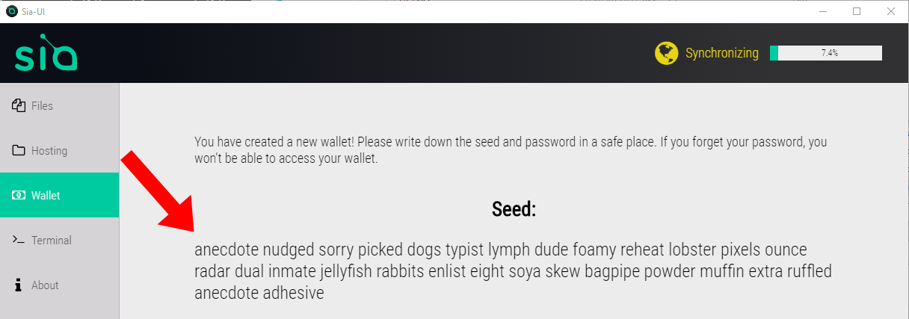

---

# A seedy reddit post

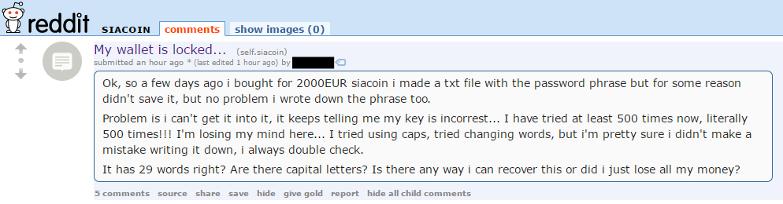

---

## I spent €2,000 on this Sia thing...

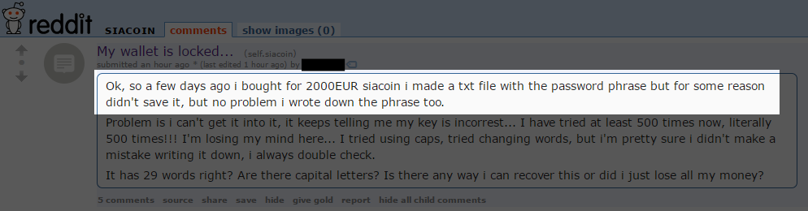

---

## Literally 500 tries

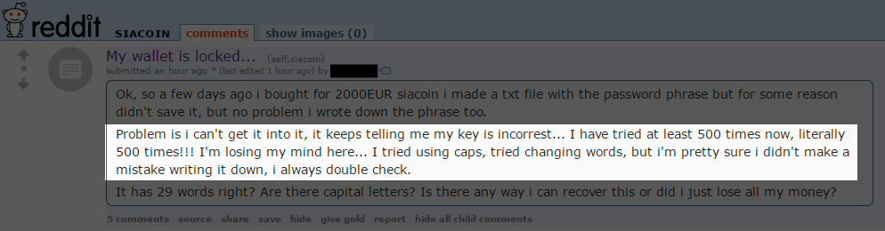

---

### Would publishing my password help?

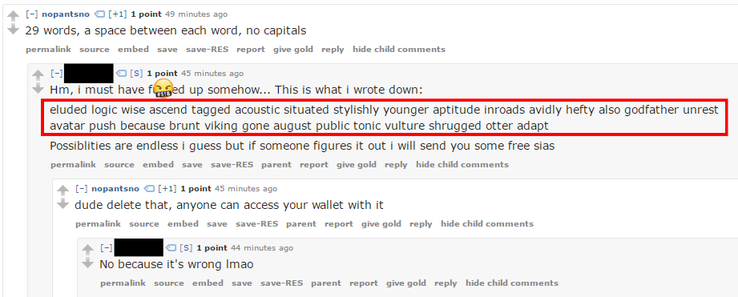

---

# A seedy reddit post

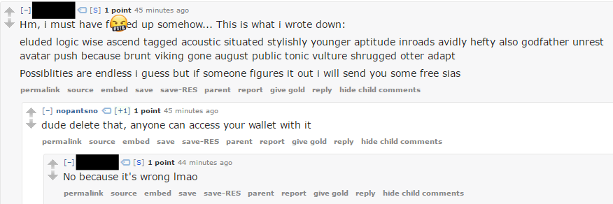

---

# I'm *pretty sure* I didn't make a mistake

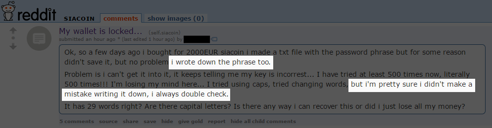

---

# Finding the mistake

* Transposed letters?
* Added or subtracted letters?
* Incorrect letter?

* TODO: Give examples

---

# Where did those words come from

* How did Sia generate the passphrase?

---

# To the dictionary!

* Sia uses a library called [entropy-mnemonics](https://github.com/NebulousLabs/entropy-mnemonics)
* Its dictionary contains 1,626 words

```golang
  englishDictionary = Dictionary{
    "abbey",
    "abducts",
    "ability",
    "ablaze",
    "abnormal",
    "abort",
    "abrasive",
    "absorb",
    "abyss",
    "academy",
    "aces",
    "aching",
    "acidic",
    "acoustic",
    "acquire",
    "across",
    "actress",
    ...
```
---

# Ctrl+F my way to riches

* Which word is not in the dictionary?

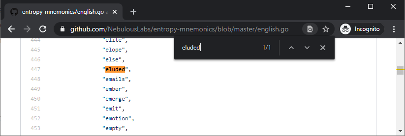

---

# No dice

* Every word is in dictionary

---

# Finding similar words

* How do we find words that are one copying error away from one another?

---

# Levenshtein distance

* Measures "edit distance" between two words

| Word A  | Word B  | Distance  |
|---------|---------|-----------|
| ca**t** | ca**r** | 1         |
| ca**t** | **s**ca**r** | 2    |

TODO: One more example

---

# Framing the problem

```text
eluded logic wise ascend tagged acoustic situated stylishly younger aptitude inroads
avidly hefty also godfather unrest avatar push because brunt viking gone august public
tonic vulture shrugged otter adapt
```

---

# Finding alternate candidates

Checking the word `wise`

| Dictionary word | Levenshtein distance |
|-----------------|----------------------|
| `abbey`         | 4                    |
| `abducts`       | 7                    |
| `ability`       | 6                    |
| ...             | ...                  |
| <span style="background: hotpink">`wife`</span>          | <span style="background: hotpink">1</span>                    |
| `wildly`        | 4                    |

---

# Finding alternate candidates

| Position | Word     | Alternate Candidates |
|----------|----------|----------------------|
| 1        | `eluded` |                      |
| 2        | `logic`  |                      |
| 3        | `wise`   | `wife`               |
| 4        | `ascend` |                      |
| 5        | `tagged` | `jagged`, `nagged`   |
| ...      | ...      | ...                  |

---

# Finding a Levenshtein implementation

* TODO: Screenshot of PyPI package
* TODO: Console output of pip installing

---

# Using Levenshtein library

* TODO: Example API usage

---

# A quick 'n dirty Levenshtein search

```python
import Levenshtein

seed = raw_input('enter your wallet seed: ')

for seed_word in seed.split():
  for dict_word in open('dictionary.txt'):
    dict_word = dict_word.strip()
    distance = Levenshtein.distance(seed_word, dict_word)
    if distance != 1:
      continue
    print '"%s" -> "%s"\n%s\n' % (seed_word, dict_word,
                                  seed.replace(seed_word, dict_word))
```

---

# Running the search

```text
$ python recover.py
enter your wallet seed: eluded logic wise ascend tagged acoustic situated stylishly younger aptitude inroads avidly hefty also godfather unrest avatar push because brunt viking gone august public tonic vulture shrugged otter adapt

"wise" -> "wife"
eluded logic wife ascend tagged acoustic situated stylishly younger aptitude inroads avidly hefty also godfather unrest avatar push because brunt viking gone august public tonic vulture shrugged otter adapt

"tagged" -> "jagged"
eluded logic wise ascend jagged acoustic situated stylishly younger aptitude inroads avidly hefty also godfather unrest avatar push because brunt viking gone august public tonic vulture shrugged otter adapt

"tagged" -> "nagged"
eluded logic wise ascend nagged acoustic situated stylishly younger aptitude inroads avidly hefty also godfather unrest avatar push because brunt viking gone august public tonic vulture shrugged otter adapt

"aptitude" -> "altitude"
eluded logic wise ascend tagged acoustic situated stylishly younger altitude inroads avidly hefty also godfather unrest avatar push because brunt viking gone august public tonic vulture shrugged otter adapt

"push" -> "lush"
eluded logic wise ascend tagged acoustic situated stylishly younger aptitude inroads avidly hefty also godfather unrest avatar lush because brunt viking gone august public tonic vulture shrugged otter adapt

"brunt" -> "grunt"
eluded logic wise ascend tagged acoustic situated stylishly younger aptitude inroads avidly hefty also godfather unrest avatar push because grunt viking gone august public tonic vulture shrugged otter adapt

"tonic" -> "ionic"
eluded logic wise ascend tagged acoustic situated stylishly younger aptitude inroads avidly hefty also godfather unrest avatar push because brunt viking gone august public ionic vulture shrugged otter adapt

"tonic" -> "sonic"
eluded logic wise ascend tagged acoustic situated stylishly younger aptitude inroads avidly hefty also godfather unrest avatar push because brunt viking gone august public sonic vulture shrugged otter adapt

"tonic" -> "topic"
eluded logic wise ascend tagged acoustic situated stylishly younger aptitude inroads avidly hefty also godfather unrest avatar push because brunt viking gone august public topic vulture shrugged otter adapt

"tonic" -> "toxic"
eluded logic wise ascend tagged acoustic situated stylishly younger aptitude inroads avidly hefty also godfather unrest avatar push because brunt viking gone august public toxic vulture shrugged otter adapt

"adapt" -> "adept"
eluded logic wise ascend tagged acoustic situated stylishly younger aptitude inroads avidly hefty also godfather unrest avatar push because brunt viking gone august public tonic vulture shrugged otter adept

"adapt" -> "adopt"
eluded logic wise ascend tagged acoustic situated stylishly younger aptitude inroads avidly hefty also godfather unrest avatar push because brunt viking gone august public tonic vulture shrugged otter adopt
```

---

# Checking seed candidates

"wise" -> "wife"

```text
$ siac wallet init-seed
Seed: eluded logic wife ascend tagged acoustic situated stylishly younger aptitude inroads avidly hefty also godfather unrest avatar push because brunt viking gone august public tonic vulture shrugged otter adapt

Could not initialize wallet from seed: error when calling /wallet/init/seed: seed failed
checksum verification
```

---

# Checking seed candidates

"tonic" -> "ionic"

```text
$ siac wallet init-seed
Seed: eluded logic wise ascend tagged acoustic situated stylishly younger aptitude inroads avidly hefty also godfather unrest avatar push because brunt viking gone august public ionic vulture shrugged otter adapt

Wallet initialized and encrypted with seed.
```

---

# Checking the loot

```text
$ siac wallet
Wallet status:
Encrypted, Unlocked
Confirmed Balance:   594.8 SC
```

---

# I thought you said €2,000...

* 594.8 SC ~= €10
* Where'd the rest of the money go?

---

# Yoinks

* TODO: Screenshot of SiaStats move to my wallet

---

# About that €2,000...

```bash
$ siac wallet transactions
[height]          [transaction id]    [net siacoins]   [net siafunds]
  108589   427b72c98e8ea64fba2...         594.83 SC             0 SF
  109002   2304da26d61bd2cb7fc...        -594.55 SC             0 SF
```

---

# Maybe the money was in limbo

* TODO: Screenshot of exchange problems post

---

# How do you steal money when it's not there yet?

* Naive approach: Infinitely set the transfer
  * But what if I incorrectly guess the amount?
* I'm playing *The Price is Right*.

---

# Draining little by little

```
for /l %%x in (1, 0, 100) do (
   siac wallet send siacoins 2000SC fff0228f02a01cf8e037047a5ea0db5a88d614913af5f21de209ebf2e58431c68cfc9c27d0e4
)
```

---

# Informing the owner

* What I could buy with the money

---

# I know you said €2,000, but...

* I'm not pocketing your money.

---

# Doing the right thing

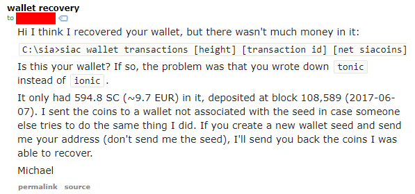

---

# And then...

Nothing

TODO: Show screenshot of deleted post

---

# Mystery solved

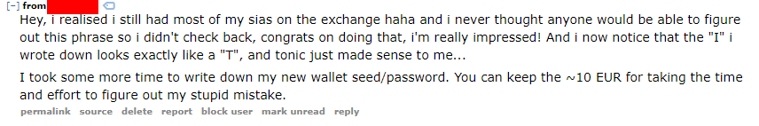

---

# Why can't you guess every possible passphrase?

* TODO: Screenshot of people suggesting guessing every passphrase

---

# Why can't you guess every possible passphrase?

* 29<sup>1,626</sup> ~= 10<sup>2,377</sup> possible passphrases
* Brute forcing every possible private key: 10<sup>77</sup>

---

# Did I commit a crime?

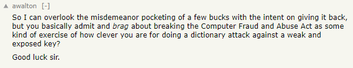

---

# Did I commit a crime?

* TODO: Go over CFAA to say why it's not.

---

# Lessons learned

* Cryptographic keys are fragile.
  * Information you reveal weakens them more than you might expect.
* Avoid human copying for precious data.
* Keep track of where you announce major financial losses.
* I love clean code, but quick 'n dirty works when there's a time crunch.

---

# WanderJest

* TODO: WanderJest screenshot

---

# Thanks!

* Full blog post is at https://mtlynch.io/stole-siacoin/
  * Or Google "stole siacoin"
* Twitter: [@deliberatecoder](https://twitter.com/deliberatecoder)
* Email: michael@mtlynch.io
* Slides: https://decks.mtlynch.io/nerds-2020/