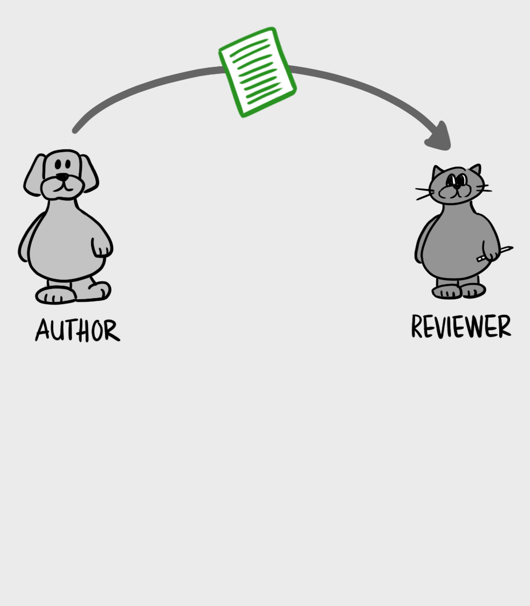
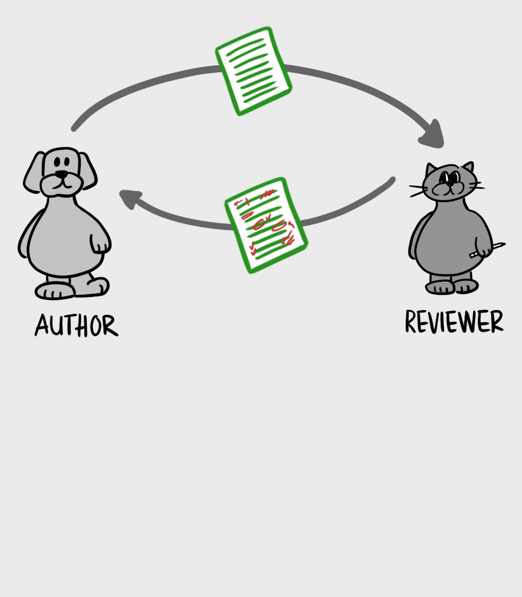
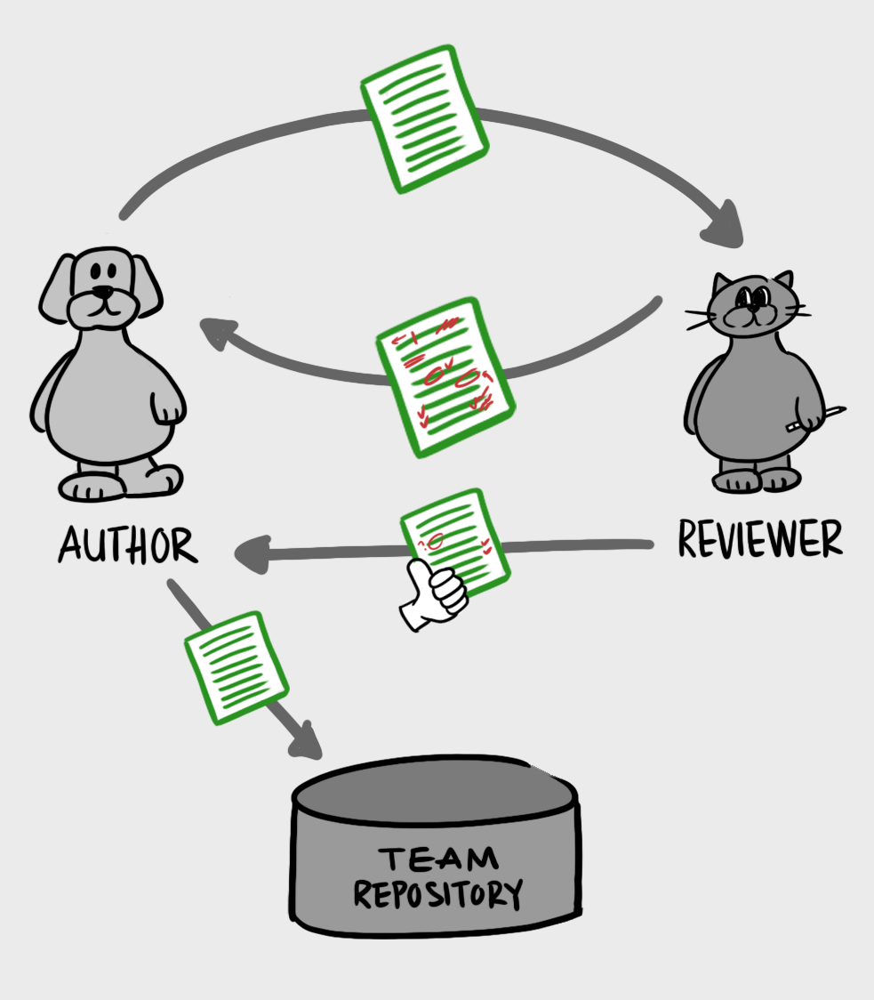
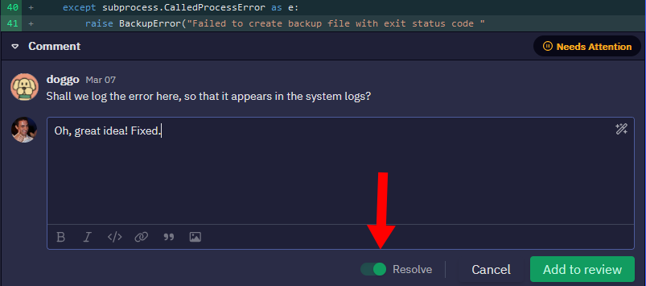

+++
title = "How to Make Your Code Reviewer Fall in Love with You"
date = 2023-03-18
conference = "NERD Summit"
outputs = ["Reveal"]
+++

<!--

Hello, everyone!

Welcome. Thank you for coming. My name is Michael Lynch, and this talk is How to Make Your Code Reviewer Fall in Love with You.

I'm going to talk about how to improve code reviews when you're the author. A lot of developers neglect this part of the review because they think that their reviewer is the one who drives the code review. And the reviewer does a lot of heavy lifting, but when we're the author, we're still half of the review. We're responsible for starting things off on the right foot and keeping things on track, and a lot of developers forget that.

The goal of this talk is to make you so good at code reviews that your code reviewer will fall in love with you.

And I know some of you might be thinking, "I don't really want my reviewer to fall in love with me. I just want a professional relationship with them."

They're going to fall in love with you. In this business, you're either bad at preparing your code for review, or you're so good at it that your reviewer is impressed with your skills that they simply fall in love with you.

-->

 - March 18, 2023

Michael Lynch ([mtlynch.io](https://mtlynch.io))

https://decks.mtlynch.io/nerds-2023/

---

## Improve code reviews as the author

<ul>
{}<li>Too few developers think about it</li>{}
{}<li>You're half of the review</li>{}
{}<li>You have a significant impact on the outcome</li>{}
</ul>

---

# Goal

* Become so good at code reviews that...

---

# Your code reviewer will fall in love with you

{}Literally{}

---

## But I don’t want my reviewer to fall in love with me

---

#### They're going to fall in love with you

{}## Deal with it{}

---

## Why improve your code reviews?

* Helps
  * Your reviewer
  * Your team
  * You

---

## Learn faster

<ul>
{}<li>Directs your reviewer's attention to important areas</li>{}
{}<li>Elicits more constructive feedback from your reviewer</li>{}
</ul>

---

## Make others better

<ul>
{}<li>Sets an example for your colleagues</li>{}
{}<li>Makes your job easier when they send code to you</li>{}
</ul>

---

## Minimize team conflicts

<ul>
{}<li>Code reviews a common source of friction</li>{}
{}<li>Conscientious approach minimizes arguments</li>{}
</ul>

---

### What is a code review?

* Consists of **author** and **reviewer**
* Author sends a **changelist** to reviewer

---

### What is a code review?

* Review happens in **rounds**
  * Author sends changelist
  * Reviewer gives feedback

---

### What is a code review?

* Review ends when reviewer **approves** the changelist

---

## The golden rule

{}
### Value your reviewer's time
{}

---

### Value your reviewer's time

<ul>
{}<li>Easiest thing to do is a lazy review</li>{}
{}<li>A quality review is a gift</li>{}
{}<li>Reward them for putting in the time</li>{}
{}<li>Developer time is a scarce resource</li>{}
</ul>

---

### Review your own code first

---

### Review your own code first

* Come back to the code with fresh eyes
    * Review your code after taking a few hours away

---

### Review your own code first

* Put yourself in reviewer's shoes
    * Imagine you don't have context as author
* Use a diff view

---

### Review your own code first

* Your reviewer should **not** see:
    * Debug code you forgot to delete
    * Extra files you accidentally included
    * Unresolved merge conflicts

---

### Review your own code first

Which is easier?

<ol>
{}<li>Reviewer identifies the bug</li>{}
{}<li>Reviewer writes a note explaining the bug to you</li>{}
{}<li>Author reads the note</li>{}
{}<li>Author finds the relevant code</li>{}
{}<li>Author makes the fix</li>{}
{}<li>Author sends the revised code to reviewer</li>{}
{}<li>Reviewer verifies the fix</li>{}
</ol>

---

### Review your own code first

Which is easier?

<ol>
{}<li>Author identifies the bug</li>{}
{}<li>Author fixes the bug</li>{}
</ol>

---

### Write a clear changelist description

* Everything the reviewer needs should be in the code or the description

---

### Write a clear changelist description

* Other people might read it beyond the reviewer
  * Teammates not on the review
  * People from other teams
  * You, in a year

---

### Write a clear changelist description

* Explain the **context** around the change
  * The **why** not the **how**

---

### Write a clear changelist description

Example **bad** changelist description

>**Move user.js**
>
>This change moves user.js to the src/controllers/auth directory.

---

### Write a clear changelist description

Example **good** changelist description

>**Move user.js to src/controllers/auth**
>
>When we created user.js, most of its callers lived in src/lib/user.
>
>We did a lot of restructing as part of the 4.2.x release, so now all of user.js's clients live in src/controllers/auth, so this change moves user.js to be closer to the majority of its clients.

---

## Automate the easy stuff

* Review time is valuable
* Don't use human reviewers to:
  * Format code
  * Identify style violations
  * Identify build failures

---

## Automate the easy stuff

---

## Automate the easy stuff

* Shift heavy lifting to computers with:
  * Continuous integration (CI)
  * git pre-commit hooks
  * Integrate linters/formatters in your editor

---

### Separate functional and non-functional changes

---

### Separate functional and non-functional changes

* How it happens
  * Author makes a small change
  * Editor is configured to auto-format on change
  * Author doesn't notice / care

---

### Separate functional and non-functional changes

| Changelist | Review difficulty |
|------------|------------|
| One-line change | Easy |
| Whitespace-only change | Easy |
| One-line functional change within 200 lines of whitespace changes | **Painful** |

---

### Separate functional and non-functional changes

---

## Communicate your responses explicitly

1. Author sends changelist
1. Reviewer gives notes
1. Author pushes new commits

What happens next?

---

## Communicate your responses explicitly

---

## Communicate your responses explicitly

---

## Answer questions with the code itself

---

#### Answer questions with the code itself

---

## Answer questions with the code itself

* If your reviewer has this question, others will too

---

## Answer questions with the code itself

* Prevent future readers from having the question
  * Refactor code to improve clarity
  * Add code comments for things you can't express with naming/structure

---

## Respond graciously to critiques

<ul>
{}<li>It's about the code not about you</li>{}
{}<li>Stay objective even if your reviewer is not</li>{}
{}<li>Resist defensiveness</li>{}
</ul>

---

## Respond graciously to critiques

---

## Respond graciously to critiques

* Reviewer catching subtle mistakes is a good sign
  * You've eliminated the easy stuff

---

## Be patient when your reviewer is wrong

---

## Be patient when your reviewer is wrong

* A misunderstand of the code: still a red flag

---

## Be patient when your reviewer is wrong

>There are two ways of constructing a software design. One way is to make it so simple that there are obviously no deficiencies. And the other way is to make it so complicated that there are no obvious deficiencies.
>
>-Tony Hoare

---

## Be patient when your reviewer is wrong

* Can you prevent future readers from misunderstanding?
  * Refactor the code
  * Add comments to clarify intent
  * Add tests

---

## Artfully solicit missing information

>**Reviewer**: This function is confusing.

---

## Artfully solicit missing information

Example **bad** response (defensive)

>**Reviewer**: This function is confusing.
>
>**Author**: What, exactly, is confusing about it?

---

## Artfully solicit missing information

Example **good** response (agreeable)

>**Reviewer**: This function is confusing.
>
>**Author**: What changes would be helpful?

---

## Artfully solicit missing information

* Take a stab at it
  * Find *something* to improve about your code

---

## Award all ties to your reviewer

---

## Award all ties to your reviewer

>**Reviewer**: I think this 8-line function would be better as two 5-line functions.
>
>**Author**: I think it's clearer as a single function.

Who's right?

---

## Award all ties to your reviewer

* **Reviewer** has better perspective reading the code fresh
* If both participants have equal evidence, defer to reviewer

---

# Review

1. Review your own code first
1. Write a clear changelist description
1. Automate the easy stuff
1. Separate functional and non-functional changes
1. Communicate your responses explicitly
1. Answer questions with the code itself
1. Respond graciously to critiques
1. Be patient when your reviewer is wrong
1. Artfully solicit missing information
1. Award all ties to your reviewer

---

## The golden rule

### Value your reviewer's time

---

# Thanks!

* Full blog post is at https://mtlynch.io/code-review-love/
  * Or Google "code review love"
* Mastodon: [michael@m.mtlynch.io](https://m.mtlynch.io/@michael)
* Twitter: [@deliberatecoder](https://twitter.com/deliberatecoder)
* Co-host monthly Indie Founders meetup
* Email: michael@mtlynch.io
* Slides: https://decks.mtlynch.io/nerds-2023/
