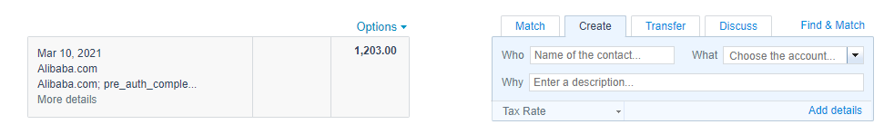
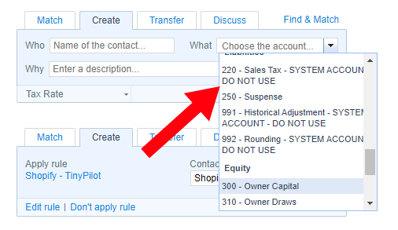
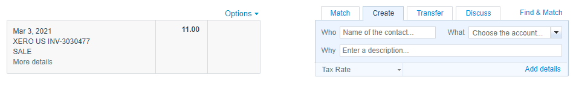

+++
title = "An Introduction to Plaintext Accounting"
date = 2021-03-19
conference = "Indie Hackers - March"
outputs = ["Reveal"]
+++

## 

 19, 2021

Michael Lynch ([@deliberatecoder](https://twitter.com/deliberatecoder))

https://decks.mtlynch.io/plaintext-accounting/

---

### Xero sucks

* Xero help to the user in processing transactions

---

### Xero sucks

* It natively includes a bunch of garbage accounts

---

### Xero can't classify Xero

---

### Issues with Xero

* No easy way to fix systemic errors
* Transactions can be "deleted", "unreconciled", and "removed"
  * What's the difference?
* High lock-in
  * Difficult to take your data elsewhere

---

### The plaintext way

Demo

---

## Full Disclosure

* I'm not an expert at accounting or plaintext accounting
* Based on a few months of experiments

---

#### Benefits of plaintext accounting

* Low abstraction means it's easy to reason about
* Can fix most systemic errors with find/replace
* Easy to write helper scripts

---

#### Benefits of plaintext accounting

* Everything under source control
* Possible to migrate between tools

---

#### Drawbacks of plaintext accounting

* Cooperation among users is surprisingly bad
  * Everyone seems to be duplicating effort in converting the same file formats over and over

---

#### Drawbacks of plaintext accounting

* You're making your books unusual
  * "Nobody ever got fired for choosing QuickBooks."

---

#### Drawbacks of plaintext accounting

* Documentation is about philosophy more than usage
  * [Beancount Docs](https://beancount.github.io/docs/index.html)
  * [Ledger Docs](https://www.ledger-cli.org/3.0/doc/ledger3.html)

---

### Double Entry Accounting with Graph Theory

* [Accounting for Computer Scientists](https://martin.kleppmann.com/2011/03/07/accounting-for-computer-scientists.html)

---

## [Beancount](https://beancount.github.io/docs/)

* My favorite
* Python-based

---

## [Beancount](https://beancount.github.io/docs/)

* Pros
  * Nice web interface
  * Fairly mature
  * Focused on financial accounting
  * Easy to install

---

## [Beancount](https://beancount.github.io/docs/)

* Cons
  * Steep learning curve
    * File format is strict
    * Lots of work to get imports working
  * v2 (stable) to v3 (incomplete) transition adds confusion
  * Most reports are web-only

---

## [Ledger](https://www.ledger-cli.org/)

* The OG of plaintext accounting
* Written in C++

---

## [Ledger](https://www.ledger-cli.org/)

* Pros
  * Most mature and popular tool
  * Nice, flexible plaintext reports

---

## [Ledger](https://www.ledger-cli.org/)

* Cons
  * I had trouble installing a recent version / installing from source
  * Transaction importing tools were hard to use

---

## [hledger](https://hledger.org/)

* Written in Haskell

---

## [hledger](https://hledger.org/)

* Pros
  * Their [quick start](https://hledger.org/quickstart.html) is *actually* quick
  * Easy to install
  * Native no-code [CSV importer](https://hledger.org/import-csv.html)

---

## [hledger](https://hledger.org/)

* Cons
  * Importer is not powerful or intuitive enough for me

---

### Useful resources

* [plaintextaccounting.org](https://plaintextaccounting.org/)
* [/r/plaintextaccounting](https://www.reddit.com/r/plaintextaccounting/)

---

# Questions?
