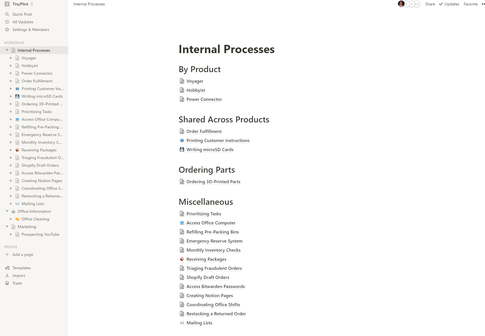
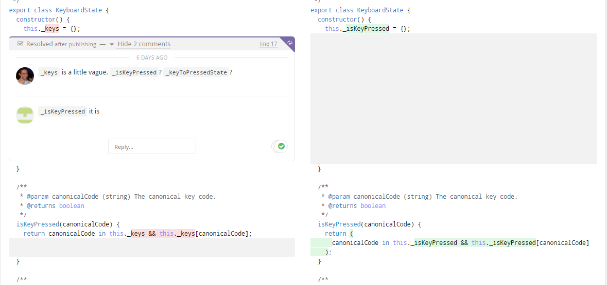
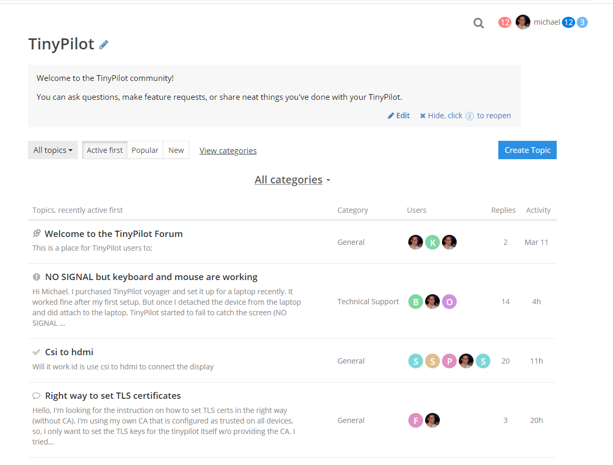
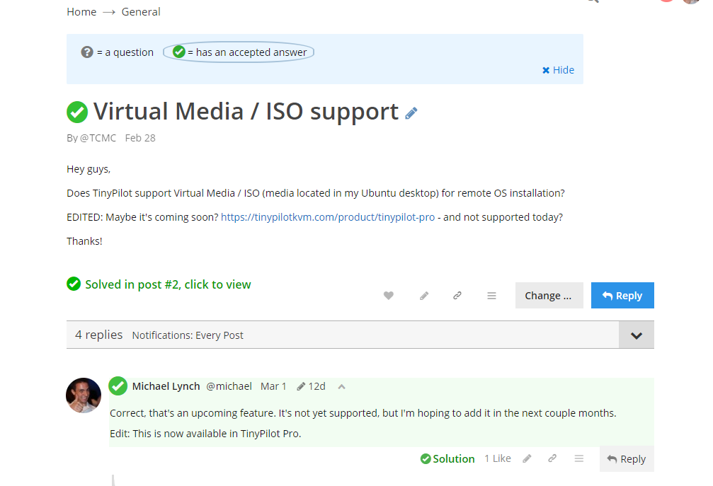
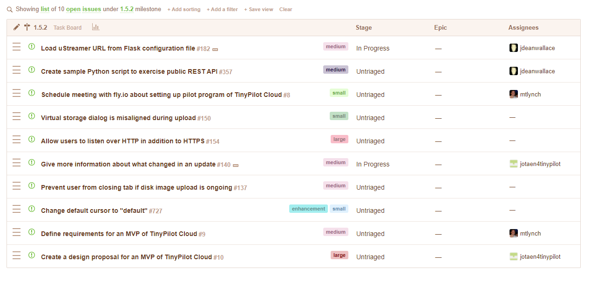
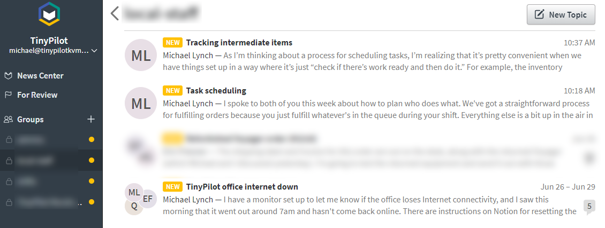
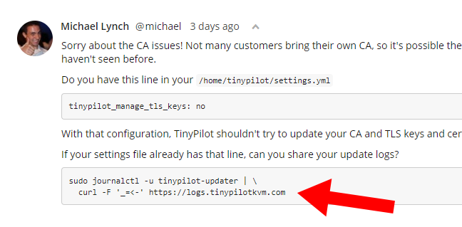
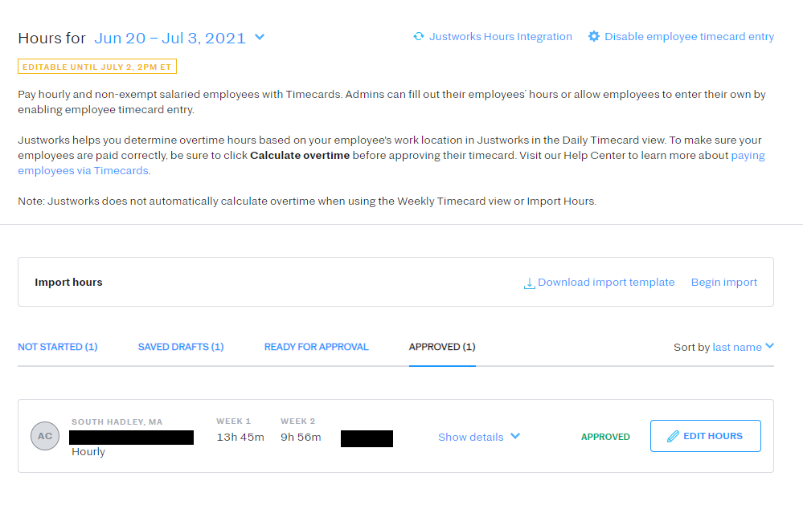
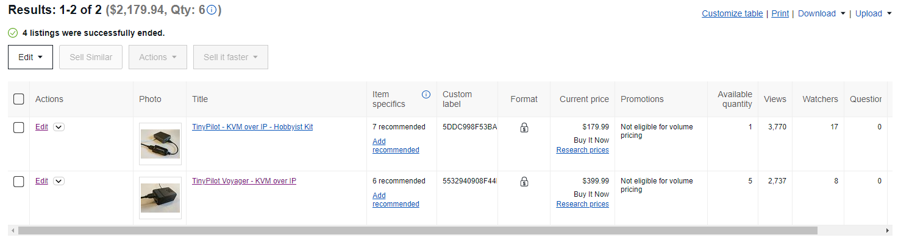

+++
title = "The Many Services that Run TinyPilot"
date = 2021-07-01
conference = "Indie Hackers - July"
outputs = ["Reveal"]
+++

## 

 1, 2021

Michael Lynch ([@deliberatecoder](https://twitter.com/deliberatecoder))

https://decks.mtlynch.io/services-run-tinypilot/

---

## Shopify

eCommerce platform ($29/mo + $10/mo add-ons)

---

## Shopify

* Pros
  * Easy to use
  * Inexpensive
  * Reliable

---

## Shopify

* Cons
  * Expects to manage your entire operation (website, inventory, CRM)
  * Relies on third-party apps for core features (creating invoices, offering subscriptions)
  * Third-party apps get way too much data

---

## Notion

Knowledge base ($10/mo/person, $40/mo total)

---

## Notion

---

## Notion

* Pros
  * Pretty user-friendly (modulo some footguns)
  * Better as a knowledge base than Google Docs
  * Searchable

---

## Notion

* Cons
  * Lots of UI gotchas
  * Workflow forces you to frequently bounce between keyboard and mouse

---

## Reviewable

Code reviews ($39/month)

---

## Reviewable

* Pros
  * One of the few tools that supports for multi-round reviews
  * Clean integration with Github

---

## Reviewable

* Cons
  * Requires broad user permissions
  * Web app is flaky
  * Confusing for developers coming from Github code reviews
  * No feature development for years

---

## [TalkYard](https://www.talkyard.io/)

Customer support forum ($38/month\*)

\* on a pay-what-you want basis

---

## [TalkYard](https://www.talkyard.io/)

---

## [TalkYard](https://www.talkyard.io/)

* Pros
  * Good UI
  * Privacy-friendly
  * Markdown-friendly
  * Extremely affordable pricing
  * Personalized customer service directly from the founder
  * Open-source

---

## [TalkYard](https://www.talkyard.io/)

* Cons
  * Slow feature development

---

## CodeTree

Bug prioritization ($24/month)

---

## CodeTree

* Pros
  * Shows aggregate view of bugs from different Github repos

---

## CodeTree

* Cons
  * Difficult to navigate
  * Confusing pricing (an organization counts as a user?)
  * Poor customer support
  * No feature development

---

## TopicBox

Internal mailing lists ($20/month)

---

## TopicBox

* Pros
  * Clean UI
  * Simple interface

---

## TopicBox

* Cons
  * Using a custom domain requires manual intervention from support
  * Limited administrative controls

---

## [LogPaste](http://logpaste.com/)

Diagnostic log sharing ($6/month self-hosted)

<video controls="" width="500">
  <source src="https://mtlynch.io/litestream/tinypilot-shareable-log.mp4" type="video/mp4">
  Your browser does not support the video tag.
</video>

---

## [LogPaste](http://logpaste.com/)

---

## [LogPaste](http://logpaste.com/)

* Pros
  * I built it
  * Open-source
  * Simple for customers to use
  * Inexpensive to run

---

## [LogPaste](http://logpaste.com/)

* Cons
  * No new features unless I add them
  * No admin dashboard

---

## BitWarden

Secure secret sharing ($12/month)

---

## BitWarden

* Pros
  * Open-source
  * Independent reimplementations of server exist
  * Supports many platforms and browsers

---

## BitWarden

* Cons
  * Lots of confusing UI paths
  * Browser integration is only okay

---

## JustWorks

HR-as-a-service

---

## JustWorks

* Pros
  * Payroll has been smooth
  * Handle legal requirements

---

## JustWorks

* Cons
  * Hidden fees
  * No way for employees to request reimbursement
  * Tight turnaround on payroll approval
  * Poor customer support
  * Ask for same information over and over

---

## Sentry

Error monitoring (sales site)

---

## Cronhub

Service monitoring

---

## Stripe

* Pros
  * Nice UI
  * Easy subscription button

---

## Stripe

* Cons
  * Terrible for eCommerce
  * Dev integrations are super complicated

---

## eBay

Sales channel

---

## EmailOctopus

Public mailing list

---

## Tailscale

* VPN ($0/month)

---

## Beancount

* Bookkeeping ($0/month)

---

## Beancount

* Pros
  * Free
  * More power than any SaaS bookkeeping apps
  * Doesn't fund [the parasite that is Intuit](https://www.propublica.org/article/inside-turbotax-20-year-fight-to-stop-americans-from-filing-their-taxes-for-free)

---

## Beancount

* Cons
  * Steep learning curve
  * You have to self-host it

---

## Google Cloud Platform

Web hosting

---

## Mercury

Business checking

---

## Chase

Business credit card

---

## Chase

* Pros
  * They gave me a credit card
  * Decent bank

---

## Chase

* Cons
  * $3k credit limit (my monthly expenses are sometimes up to $30k)
  * Poor customer support
  * They keep sending me weird paper statements

---

## PayPal

* Payment processing (via Shopify) (2.9-4.4% per transaction)

---

## PayPal

* Pros
  * Customers like it

---

## PayPal

* Cons
  * Withhold money sometimes due to investigations
  * Tedious to move money back to checking

---

## Stripe

Subscription management

---

## Google Docs / Sheets

* Inventory tracking
* Design documents

---

## Github

Source hosting (main development)

---

## Microsoft VSTS

Source hosting (distribution)

---

## SavvyCal

---

## CircleCI

---

## TeamUp

---

## Gandi

---

# Questions?
