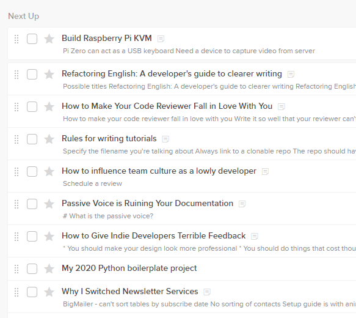
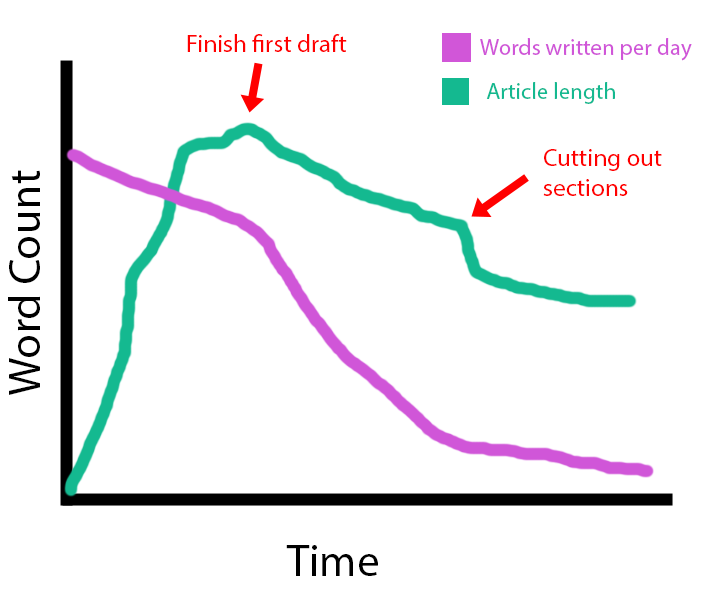
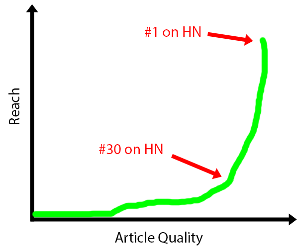

+++
title = "How to be a Sort of Successful Software Blogger"
date = 2020-05-25
conference = "Show & Tell - May"
outputs = ["Reveal"]
+++

# 

 25, 2020

Michael Lynch ([@deliberatecoder](https://twitter.com/deliberatecoder))

https://decks.mtlynch.io/show-and-tell-2020-05/

---

### Biggest bang for your buck: Pay for one professional review

* You've got lots of blind spots that a professional editor can identify.
* A good editor costs $75-150 to review 2,000 words.
  * Benefits compound for all future writing.
* I still work with my editor about once a year for tune-ups.
* Details: [Why a Freelance Editor Was a Gamechanger for My Blog](https://mtlynch.io/editor/)

---

# Picking topics: start at distribution

>**Pet shop owner**: This little guy writes mysteries under the name JB MacGregor. 
>**Lisa**: How can a hamster write mysteries? 
>**Pet shop owner**: Well, he gets the ending first, then he works backwards. 
-*The Simpsons*

* How will people find my post?
  * Search
  * Reddit / Forums
  * Hacker News
  * Twitter

---

### Search

* Continuous stream of new readers
* Relies less on luck than landing a hit on social media
* Not as exciting
  * No rush of going viral

---

### Reddit (Pros)

* Less reliant on luck in my experience
  * If I have a post that matches the subreddit, it does well.

---

### Reddit (Cons)

* Seemingly well-matched subs have many pitfalls
  * How many subscribers?
  * Do they accept external links?
  * Can I submit links to my own blog?
  * Do blogs like mine ever make it to their front page?
* Discussion quality varies by subreddit
  * Some are filled with armchair experts

---

### Hacker News (Pros)

* The startup holy grail!
* Huge amount of readers
* Intelligent, professional discussion
  * Mostly
* Causes big names to see and tweet about my posts
* Broad range of interests

---

### Hacker News (Cons)

* Luck is a huge factor in hitting front page
  * Some posts get ignored for multiple submissions then hit top spots on the front page
  * See [Victor Zhou's post history](https://news.ycombinator.com/from?site=victorzhou.com)
* Hard to predict what they'll like

---

### Twitter

* Never been a big source of readers for me
* Sometimes my posts do well there after getting exposure on Reddit / HN
* The dream: snowball effect
  * A 10k-follower user RTs, then a 100k-follower, then @BarackObama
* Reality: Never happens to me
  * Probably the exception rather than the rule

---

### This is why I can't blog about blogging

* There are forums and social networks for bloggers, but...
  * They don't accept external links
  * They don't want people popping in to promote their own posts
* Difficult to rank for almost any search term related to blogging

---

### Posts about software / technology are easier to share

* Example: 
  * [GreenPiThumb: A Raspberry Pi Gardening Bot](https://mtlynch.io/greenpithumb/)
  * Suitable for:
    * [Hacker News](https://news.ycombinator.com/item?id=14644539)
    * [/r/programming](https://www.reddit.com/r/programming/comments/6jujfi/greenpithumb_a_raspberry_pi_gardening_bot/)
    * [/r/raspberry_pi](https://www.reddit.com/r/raspberry_pi/comments/6js62b/greenpithumb_a_raspberry_pi_gardening_bot/)
    * [/r/homeautomation](https://www.reddit.com/r/homeautomation/comments/6jsalc/greenpithumb_a_raspberry_pi_gardening_bot/)
    * Raspberry Pi forums

---

### Traffic != success

I blog for a few different reasons

---

### Why I blog: Clarify my thinking

* Writing out a post forces me to organize my thoughts
* The clarity changes my future behavior and strategy

---

### Why I blog: Lead people to my products

* "Content marketing"
* [Resurrecting a Dead Library](https://mtlynch.io/resurrecting-1/)
  * Low traffic but leads people to [Zestful](https://zestfuldata.com)
* [My Second Year as a Solo Developer](https://mtlynch.io/solo-developer-year-2/)
  * Led to a surge in [What Got Done](https://whatgotdone.com/) signups

---

### Why I blog: Improve SEO for my products

* mtlynch.io
  * Ahrefs DR: 53
  * Moz DA: 46
* Any project I start has a decent backlink out of the gate

---

### Why I blog: Establish credibility

* I get good response on cold emails
* I *think* it's because my email signature includes my blog
  * Not a random, faceless stranger

---

### Why I blog: Vanity

* If I'm being honest
* Fun to have people discuss my work
* Nice to get feedback

---

# Posts that did well

---

### [Why I Quit Google to Work for Myself](https://mtlynch.io/why-i-quit-google/) 

* Unique pageviews:
  * First week: 339k
  * First year: 449k
* Why it did well
  * People are interested in Google
  * People related to frustration with corp bureaucracy
  * Story with a beginning, middle, and end

---

### [How to Do Code Reviews Like a Human](https://mtlynch.io/human-code-reviews-1/)

* Unique pageviews:
  * First week: 62k
  * First year: 123k
* Why it did well
  * Taught a skill that's widely useful
  * Different angle from most articles on the topic

---

### [Building a Homelab VM Server](https://mtlynch.io/building-a-vm-homelab/)

* Unique pageviews:
  * First week: 923
  * First year: 75k
* Why it did well
  * Approaches building homelab PC as a beginner
  * Easier than others for the reader to follow along

---

### Commonalities of the hits

* Tell an engaging or fun story
* Teach something broadly useful
* Repackage existing ideas in a way people enjoy
* The topics match social media channels that accept external links

---

# Posts that performed poorly

*Note: The majority of pageviews come from visitors who arrived at my blog from another article.*

---

### [Retrofitting Apps for Cloud Storage with Zero Code Changes](https://mtlynch.io/retrofit-docker-gcs/)

* Synopsis: Forcing cloud storage backends onto legacy apps.
* Unique pageviews:
  * First week: 300
  * First year: 1.6k
* Why it performed poorly
  * Topic is overly narrow
  * People would never find it via search

---

### [How to Hire a Cartoonist to Make Your Blog Less Boring](https://mtlynch.io/how-to-hire-a-cartoonist/)

* Unique pageviews:
  * First week: 274
  * First year: 5.9k
* Why it performed poorly
  * Blogging about blogging is too oversaturated for search
  * No viable social media channels to share it

---

### [How to Grow Quickly and Never Turn a Profit](https://mtlynch.io/keep-growing-never-profit/)

* Synopsis: Why I gave up on Is It Keto
* Unique pageviews:
  * First week: 586
  * First year: 3k
* Why it performed poorly
  * Social: Not exciting to read about failure unless it's spectacular
  * Search: Wouldn't rank for any useful queries

---

### Commonalities of flops

* Teach something overly specific
* No social media channel that will accept them
* No path to discovery through search
* Title is not self-explanatory

---

### Tracking article ideas

* When I get new ideas, I write a title and shortform notes
* I reorder the list based on what I'm most interested in writing
* Topics can spend years in my queue

---

### How I rank ideas

* How excited am I to write this?
* Do I have something unique to contribute?
* Is there an audience interested in the topic?
* Do I have a viable a channel to reach that audience?

---

### Writing my first drafts

* Just get all my ideas onto the page
* Add headings if I can think of them, but don't worry about structure
* Just keep writing continuously and don't stop to look anything up
  * I put TODOs in places where I want to add a link, look something up, or add an image.

---

### Editing

* Takes the longest time and is the most mentally taxing
* Good writing crystallizes ideas, explains them clearly and succinctly
  * This is really hard!

---

### What it looks like

---

### Why so much time editing?

* Results are not linear with effort
* 10-100x difference being on front page of Google/Reddit/HN
  * Another 5-10x difference being in the #1 spot

---

# Other tips

---

### The hook: why should people read it?

* This is the most common mistake I see.
  * Bloggers assume people have infinite patience to read their post and find the value.

---

### The hook: why should people read it?

* Establish in the first few sentences:
  * What is this post about?
  * What value will they gain by reading it?

>You have two or three sentences to hook them. A paragraph if you're lucky. -My editor

---

### Original artwork: criminally underused

* Immediately makes your post stand out
* Costs $20-60/image
  * Depends on artist and level of detail
* Make a cover image that's 1.91:1 aspect ratio
  * Displays nicely in Twitter, Facebook, and (sort of) Reddit

More details: [How to Hire a Cartoonist to Make Your Blog Less Boring](https://mtlynch.io/how-to-hire-a-cartoonist/)

---

### How hard is it to broaden accessibility?

Small changes often make my posts accessible to a much broader audience.

>I stored the files on **S3**.

vs.

>I stored the files on **S3, Amazon's cloud storage service**.

---

### Read your post aloud

* You catch so many more errors this way
* Run your post through a grammar checker / spell checker
  * Grammarly's good, not great
  * Don't blindly trust your grammar checker

---

# Questions?

* I love talking about this, so feel free to ask me after too.
