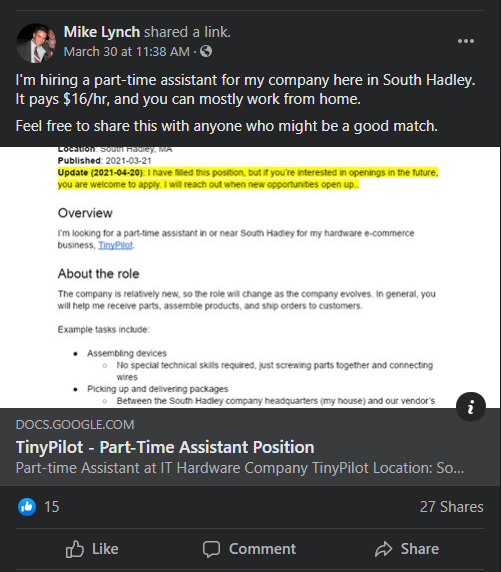
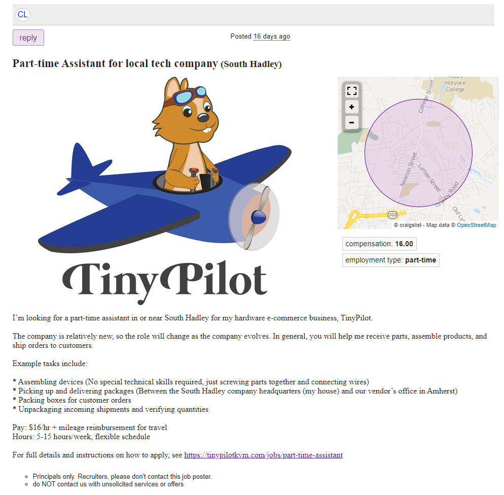
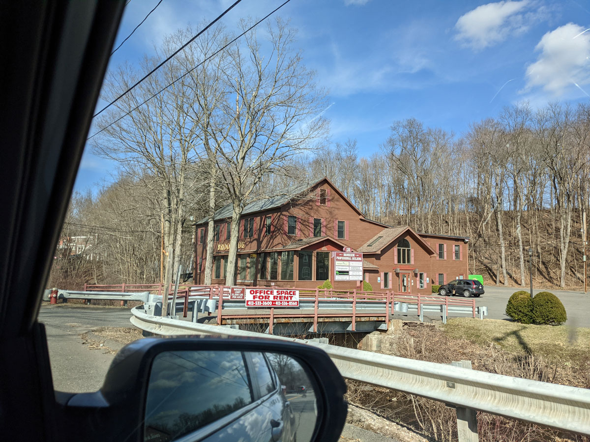

+++
title = "Systematizing TinyPilot"
date = 2021-04-22
conference = "Indie Hackers - April"
outputs = ["Reveal"]
+++

## 

 22, 2021

Michael Lynch ([@deliberatecoder](https://twitter.com/deliberatecoder))

https://decks.mtlynch.io/systematizing-tinypilot/

---

## Problem

* How can I take a two-week vacation from TinyPilot?

---

### Obstacle #1: Order fulfillment

* All TinyPilot stock is in my house
* My girlfriend is the fulfillment manager
  * She prints shipping labels, packs outgoing orders, schedules pickups

---

#### Obstacle #2: Stock replenishment

* Two weeks can clear us out
  * A spike in sales can (and has) exhausted our inventory within two weeks
* My girlfriend and I share responsibilities in reordering parts

---

### Obstacle #3: Low bus factor

* My girlfriend returns to grad school in June
  * Her availability shrinks to 5 hours per week
  * She currently works between 6 and 25 hours per week

---

### Obstacle #4: Customer support

* TinyPilot receives one to six customer support requests per day
* I'm the only one who manages customer support

---

## Finding a new assistant

* Created a [job description](https://tinypilotkvm.com/jobs/part-time-assistant)
* Created a doc about [working with me](https://docs.google.com/document/d/1EDhqJ66Xjt36rjWUzTabFpaht693k9UatEppQLmvWJ0/edit#)
  * Adapted from my [guidelines for freelance developers](https://mtlynch.io/freelancer-guidelines/)

---

### Notable things about the job

* Pay is $16/hr
  * Higher than other jobs in the area that require no degree
  * e.g., Subway pays cashiers $13-15/hr

---

### Notable things about the job

* Emphasis on non-monetary benefits
  * Flexible hours
  * Work with a growing "tech startup"

---

### Sharing on Facebook

---

### Sharing on Craigslist

---

## Sharing Results

| Channel               | Applications | Interviews | Hires |
|-----------------------|--------------|------------|-------|
| Personal connections  | 0            | 0          | 0     |
| Local facebook groups | 5            | 2          | 1     |
| Craigslist            | 6            | 1          | 1     |

---

## Application process

1. Didn't follow instructions: archive email, no response
    * Filtered most candidates at this stage
1. Not a good match on paper: Email response
1. Strong candidate: Offer interview
1. Good interview: Offer job

---

#### New employee training: start small

1. Assemble [power connectors](https://tinypilotkvm.com/product/tinypilot-power-connector)
1. Do functional testing of power connectors
1. Assemble [Voyagers](https://tinypilotkvm.com/product/tinypilot-voyager)
1. Do functional testing of Voyagers

---

#### New employee training gotchas

* Hard to create training manuals!
  * Took 5-8 hours of writing per task

---

## Hiring "real" employees

* Before this, I'd always hired contractors
  * Less paperwork
* This role doesn't match IRS definition of contractor
* Need to do tax withholding, provide legal notices, etc.

---

## PEO Solutions

* Professional Employer Organization
  * Do payroll, tax withholding, legal compliance
* Got a few recommendations:
  * [**JustWorks**](https://justworks.com/) (went with this one)
  * [OnPay](https://onpay.com/)
  * [Gusto](https://gusto.com/)

---

## JustWorks as a PEO

* JustWorks is okay so far
  * They keep asking me the same questions over and over
  * Keep trying to upsell me different services
  * They hide the fact that it takes 2 weeks to activate your account

---

### Office space

---

### Office space

---

### Office space

* 15-minute walk from my house
* $550/month
  * Includes furniture and utilities

---

### Leasing process

* Only received a paper copy to sign
* Asked a lawyer to review a week ago
  * Still waiting for results

---

### The office timeline

* Move processes in phases from my house to the office

1. Product assembly
1. Functional testing
1. Pre-packing
1. Fulfillment

---

# Questions?
